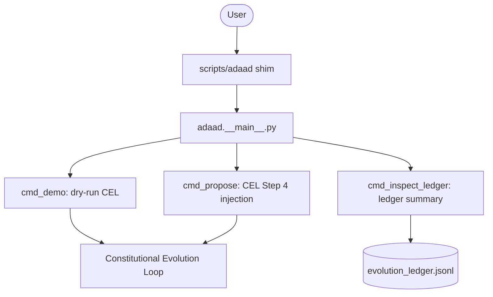

# SPDX-License-Identifier: Apache-2.0
# ADAAD System Architecture — v9.77.0

> **The short version:** ADAAD is a 16-step Constitutional Evolution Loop running three specialist AI agents inside a cryptographically enforced governance kernel. Nothing mutates without passing every gate. Everything is hash-chained. The whole thing replays deterministically from any point.

---

## System overview

```
┌──────────────────────────────────────────────────────────────────────┐
│                         ADAAD RUNTIME                                │
│                                                                      │
│   ┌──────────┐   ┌──────────┐   ┌──────────┐                        │
│   │ Architect│   │  Dream   │   │  Beast   │   ← Three agents       │
│   │  #3b82f6 │   │  #8b5cf6 │   │  #f97316 │                        │
│   └────┬─────┘   └────┬─────┘   └────┬─────┘                        │
│        │              │              │                               │
│        └──────────────┴──────────────┘                               │
│                        │                                             │
│              ┌──────────▼──────────┐                                 │
│              │  Constitutional     │                                 │
│              │  Evolution Loop     │  ← 16-step CEL                 │
│              │  (CEL)              │                                 │
│              └──────────┬──────────┘                                 │
│                         │                                            │
│              ┌──────────▼──────────┐                                 │
│              │  GovernanceGate     │  ← Final arbiter (GOV-SOLE-0)  │
│              └──────────┬──────────┘                                 │
│                         │                                            │
│              ┌──────────▼──────────┐                                 │
│              │  HUMAN-0 Gate       │  ← Tier-0 changes only         │
│              │  (non-delegatable)  │     GPG sign required          │
│              └──────────┬──────────┘                                 │
│                         │                                            │
│              ┌──────────▼──────────┐                                 │
│              │  Hash-Chained       │  ← CEPD proof DAG              │
│              │  Ledger + CEPD      │     Tamper-evident             │
│              └─────────────────────┘                                 │
└──────────────────────────────────────────────────────────────────────┘
```

---

## CLI data flow


```mermaid
graph TD
    User([User]) --> CLI[scripts/adaad shim]
    CLI --> Main[adaad.__main__.py]
    Main --> Demo[cmd_demo: dry-run CEL]
    Main --> Inspect[cmd_inspect_ledger: ledger summary]
    Main --> Propose[cmd_propose: CEL Step 4 injection]
    
    Demo --> CEL[Constitutional Evolution Loop]
    Propose --> CEL
    Inspect --> Ledger[(evolution_ledger.jsonl)]
```

---

## Module map

| Layer | Module | Responsibility |
|:------|:-------|:---------------|
| Interface | `adaad.__main__.py` | Command routing, argument parsing, sandbox enforcement |
| Interface | `scripts/adaad` | POSIX shim for local execution |
| Interface | `ui/dork.html` | DORK governance intelligence dashboard |
| Runtime | `app/main.py` | Full autonomous loop orchestrator |
| Core | `adaad/core/` | Governance-critical primitives — the `adaad-core` package |
| Evolution | `runtime/evolution/` | 16-step CEL implementation |
| Ledger | `security/ledger/` | Tamper-evident hash-chained records |
| Server | `server.py` | API server, `POST /api/dork/stream` endpoint |
| Governance | `docs/CONSTITUTION.md` | The constitutional document — 241 Hard-class invariants |
| Artifacts | `artifacts/governance/phaseNNN/` | Per-phase ILA and GPG attestation |

---

## The 16-step Constitutional Evolution Loop

Every mutation — without exception — traverses all 16 steps. No gate can be skipped. No step can be reordered. The loop is deterministic and fully replayable.

| Step | Name | Gate |
|:----:|:-----|:-----|
| 1 | SPIE innovation proposal | Self-Proposing Innovation Engine generates candidate |
| 2 | Morphogenetic memory consult | MMEM identity self-model validates historical context |
| 3 | Dream agent ideation | Creative expansion of the proposal space |
| 4 | Architect structural review | Constitutional compliance pre-check |
| 5 | Beast performance scoring | Fitness benchmark evaluation |
| 6 | AFRT adversarial challenge | Red-team cannot approve its own challenge (`AFRT-0`) |
| 7 | Fitness surface evaluation | Multi-Dimensional Fitness Surface (MDFS) scoring |
| 8 | 241-invariant constitutional scoring | Hard-class invariant matrix evaluation |
| 9 | Live Shadow Mutation Execution | Mutation runs against live traffic; impact measured |
| 10 | Blast radius modelling | BRM quantifies mutation impact surface |
| 11 | Constitutional jury verdict | 2-of-3 multi-agent verdict for high-stakes mutations |
| 12 | GovernanceGate | Final arbiter — structurally non-bypassable (`GOV-SOLE-0`) |
| 13 | HUMAN-0 gate | Tier-0 changes: GPG signature required; non-delegatable |
| 14 | GPG-signed ledger entry | Cryptographic attestation sealed to ledger |
| 15 | Hash-chained CEPD proof | Mutation proof appended to the Cryptographic Evolution Proof DAG |
| 16 | Annotated tag + release evidence | Semver tag, ILA artifact, governance sign-off |

---

## Governance invariants

All 241 Hard-class invariants are documented in [`docs/governance/V8_CONSTITUTIONAL_INVARIANTS_MATRIX.md`](docs/governance/V8_CONSTITUTIONAL_INVARIANTS_MATRIX.md).

Key structural invariants:

| Invariant | What it prevents |
|:----------|:-----------------|
| `GOV-SOLE-0` | Bypassing the GovernanceGate |
| `CLI-SANDBOX-0` | CLI-initiated mutations escaping sandbox without explicit promotion |
| `CLI-GATE-0` | CLI proposals bypassing the 16-step CEL |
| `AFRT-0` | The red-team agent approving its own challenges |
| `COMMUNITY-HUMAN0-0` | Autonomous constitutional amendment without HUMAN-0 sign-off |
| `SELF-AWARE-0` | Mutations that reduce system observability |
| `DAS-DOCKER-0` | Unpinned Docker image tags in production |
| `SPIE-HUMAN0-0` | Innovation proposals auto-approved without HUMAN-0 ratification |

---

## DORK — Governance Intelligence Layer

The **DORK** (Developer Operator Runtime Kernel) is the institutional intelligence layer. It exposes the entire constitutional history to operators via a natural-language interface, grounded in retrieved precedent (INNOV-50 · RAGS).

**Core components:**

| Component | Function |
|:----------|:---------|
| GovernanceGate | Final arbiter for all mutation approvals |
| Constitutional Lineage Engine (CLE) | Traces the evolution of the constitutional framework |
| Multi-Dimensional Fitness Surface (MDFS) | Unified real-time health and fitness topography |
| Emergent Behavior Sentinel (EBS) | Detects un-governed novelty in module interactions |
| RAGS (INNOV-50) | Grounds every DORK response in retrieved constitutional precedent |

**Strategic documentation:**
- [`docs/governance/DORK_STRATEGIC_PLAN.md`](docs/governance/DORK_STRATEGIC_PLAN.md)
- [`docs/governance/DORK_EVOLUTIONARY_ROADMAP.md`](docs/governance/DORK_EVOLUTIONARY_ROADMAP.md)

---

## Ledger and cryptographic proof chain

All governance decisions are recorded in `data/evolution_ledger.jsonl`. Each record contains:

- Mutation ID and proposal source
- CEL step-by-step gate results
- Fitness scores and invariant scores
- CEPD hash linking to predecessor
- GPG signature (Tier-0 records)

The ledger is tamper-evident: altering any record breaks the hash chain. The entire chain is verifiable with `adaad inspect-ledger data/evolution_ledger.jsonl`.

---

## Deterministic audit sandbox

The DAS (INNOV-36 · BIRC) enables one-command external verification:

```bash
docker compose up das-demo
```

No configuration. No trust required. Pinned image digest mandatory (`DAS-DOCKER-0`).

---

*For complete governance documentation, see [`docs/CONSTITUTION.md`](docs/CONSTITUTION.md).*  
*For per-phase release evidence, see [`artifacts/governance/`](artifacts/governance/).*
