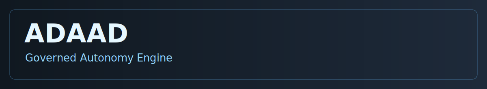
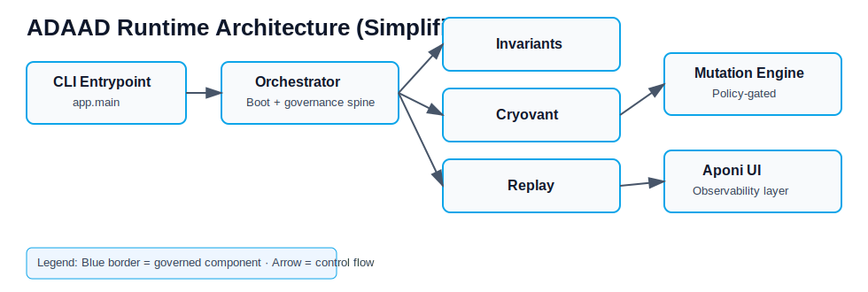

# ADAAD

> **Deterministic, policy-governed autonomous code evolution.**

<p align="center">
  
</p>

<p align="center">
  <a href="QUICKSTART.md"></a>
  
  <a href="LICENSE"></a>
  
  
</p>

<p align="center">
  <a href="QUICKSTART.md"><strong>Get Started →</strong></a> ·
  <a href="docs/manifest.txt"><strong>Documentation</strong></a> ·
  <a href="examples/single-agent-loop/README.md"><strong>Examples</strong></a> ·
  <a href="https://github.com/InnovativeAI-adaad/ADAAD/issues"><strong>Issues</strong></a>
</p>

## What is ADAAD?

ADAAD is an autonomous software development system that proposes and executes code changes under constitutional governance.

In plain terms: ADAAD automates code evolution with strict trust, replay, and policy gates so autonomy stays auditable and controlled.

## Project Status

- Authoritative current version: 0.65.x (active development line; latest tagged release: 0.65.0)
- Maturity posture: Experimental / pre-1.0 (validated governance + replay controls, mutation autonomy still staged)
- Recommended environment: Linux / WSL
- Replay strict: Production-ready
- Mutation execution: Staging-only

Mutation execution is limited to controlled environments. Production use should run in dry-run or strict replay modes unless explicitly authorized by policy.

### Validated guarantees vs roadmap

- **Validated guarantees (current branch):** deterministic governance primitives, fail-closed replay enforcement, append-only ledger lineage checks, and staged mutation execution under policy gates.
- **Roadmap items (not validated as production guarantees):** deep sandbox isolation hardening beyond current checks, cryptographic replay proof bundles for third-party verification, and federation-level governance orchestration.

## Why ADAAD?

Traditional autonomous systems typically fail in three places:

- **Runaway mutations:** autonomous edits exceed policy boundaries.
- **Weak auditability:** teams cannot explain exactly what changed and why.
- **Non-reproducible decisions:** governance results drift between runs.

ADAAD addresses this with constitutional mutation controls, append-only lineage journals, and replay verification.

| Traditional automation | ADAAD |
|---|---|
| Pipeline-centric | Governance-first autonomy |
| Manual policy checks | Constitution-enforced approvals |
| Limited mutation history | Full lineage + journal trail |
| Risk of silent drift | Replay verification + fail-closed controls |

## Quick start

Use [QUICKSTART.md](QUICKSTART.md) for the full setup, validation, and reset workflow.

```bash
git clone https://github.com/InnovativeAI-adaad/ADAAD.git
cd ADAAD
python -m venv .venv
source .venv/bin/activate
pip install -r requirements.server.txt
python nexus_setup.py
python -m app.main --replay audit --verbose
```

## Expected Boot Output (Replay Audit)

You should see boot-stage diagnostics including:

- Governance spine initialization
- Replay baseline comparison
- Cryovant validation result
- Capability registration summary
- Mutation cycle status (enabled / disabled)

## Architecture at a glance

ADAAD is organized into three runtime layers:

1. **Trust Layer (Cryovant):** validates environment trust and ancestry signals.
2. **Governance Layer (Constitution):** evaluates whether a mutation can proceed.
3. **Execution Layer (Dream / Beast / Architect):** discovers, scores, and runs approved work.

Text fallback:

```text
app.main
 ├── Orchestrator
 │    ├── Invariants
 │    ├── Cryovant
 │    ├── Replay
 │    ├── MutationEngine
 │    └── GovernanceGate
 └── Aponi Dashboard
```

<p align="center">
  
</p>

<p align="center">
  
</p>


## Governance surfaces

| Surface | Fail behavior | Evidence |
|---|---|---|
| Invariants | Boot halt | Metrics + journal |
| Cryovant | Boot halt | Journal entry |
| Replay strict | Boot halt | `replay_verified` event |
| Constitution | Mutation reject | Rejection event |
| Ledger integrity | Governance stop | Hash continuity checks |

## Replay epochs

Replay epochs represent deterministic governance snapshots. Each epoch includes:

- Baseline digest
- Ledger state hash
- Mutation graph fingerprint
- Constitution version

Strict replay requires identical epoch reconstruction.


## Canonical governance import paths

Use `runtime.*` as the authoritative implementation path for governance and replay primitives:

- Foundation utilities: `runtime.governance.foundation.{canonical,hashing,clock}`
- Evolution scoring/state machine/checkpoint: `runtime.evolution.{scoring,promotion_state_machine,checkpoint}`
- Replay/governor integrations import only from `runtime.governance.*` and `runtime.evolution.*`
- Runtime deterministic provider abstraction: `runtime.governance.foundation.determinism`

A compatibility package `governance.*` exists only as a thin adapter that re-exports `runtime.governance.*` for external callers. New internal code should not add alternate implementation trees.

## Determinism Scope

ADAAD guarantees deterministic governance decisions given identical:

- Replay baseline
- Mutation inputs
- Fitness scoring configuration
- Trust mode

External nondeterminism (network, time, entropy) must be sandboxed.

## Sovereignty requirements matrix (implemented vs planned)

| Requirement | Current state | Status | Notes |
|---|---|---|---|
| Deterministic substrate | Canonical deterministic foundation (`runtime.governance.foundation.*`) with replay-seed propagation and determinism tests | Implemented | Treated as a validated guarantee for governance/replay paths |
| Sandbox hardening depth | Policy validation + syscall/fs/network/resource enforcement + evidence hashing | Partially implemented | Additional hardening depth remains roadmap (defense-in-depth and broader isolation coverage) |
| Replay proofs | Deterministic replay verification and parity harnesses in-tree | Partially implemented | Cryptographic/exportable replay proof bundles are roadmap |
| Federation | No cross-instance sovereignty federation runtime committed in this branch | Planned | Reserved for PR-6 scope |

## Mutation risk levels

- **Low:** refactor, logging, non-functional changes.
- **Medium:** algorithmic modifications.
- **High:** security, ledger, or governance logic.

High-risk mutations require explicit policy elevation.

## Fail-close example

Example: replay strict divergence.

```text
Expected digest: abc123
Actual digest:   def456
Result: Boot halted before mutation stage.
```

## Real-world use cases

### 1) Governed autonomous refactor
```text
[DREAM] Candidate: simplify duplicated parsing logic
[GOVERNANCE] Tier: low, constitution: pass
[MUTATION] Applied with lineage + replay evidence
```

### 2) Staging-only replay-audited mutation
```text
[REPLAY] mode=audit baseline=epoch_2026_02_14
[REPLAY] divergence=none
[MUTATION] staged for review (dry-run)
```

### 3) Policy-constrained self-improvement
```text
[ARCHITECT] Proposal affects governance path
[CONSTITUTION] Escalate to high-risk controls
[RESULT] blocked pending explicit policy elevation
```

## FAQ

### Is ADAAD a replacement for code review?
No. ADAAD automates governed mutation workflows and produces auditable artifacts; teams can still require human review where needed.

### Why does ADAAD exit immediately?
If replay mode is off, Dream mode has no discovered tasks, and no staged mutations exist, ADAAD may boot and exit cleanly.

Use diagnostics:

```bash
python -m app.main --replay audit --verbose
```

### Does ADAAD run unsafe mutations automatically?
No. Mutations must pass trust checks, replay checks, and constitutional policy gates before execution.

### Can I run ADAAD without strict replay?
Yes. Use `--replay off` or `--replay audit` in development, then `--replay strict` for high-assurance environments.

### Is dry-run supported?
Yes. Use `--dry-run` to evaluate mutation candidates and governance outcomes without applying file changes.

## Security

Security disclosures: see [docs/SECURITY.md](docs/SECURITY.md). Do not open public issues for vulnerabilities.

## Getting help

- 📖 Docs: [docs/manifest.txt](docs/manifest.txt)
- 🧪 Example loop: [examples/single-agent-loop/README.md](examples/single-agent-loop/README.md)
- 🐛 Issues: [GitHub Issues](https://github.com/InnovativeAI-adaad/ADAAD/issues)
- 💬 Discussions: [GitHub Discussions](https://github.com/InnovativeAI-adaad/ADAAD/discussions)

## Community and contribution

- Contribution guide: [CONTRIBUTING.md](CONTRIBUTING.md)
- Changelog: [CHANGELOG.md](CHANGELOG.md)
- Code of conduct: [CODE_OF_CONDUCT.md](CODE_OF_CONDUCT.md)

## License

Apache 2.0. See [LICENSE](LICENSE).
