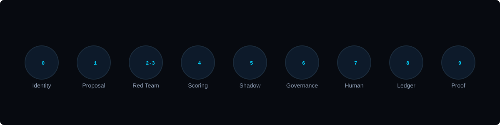
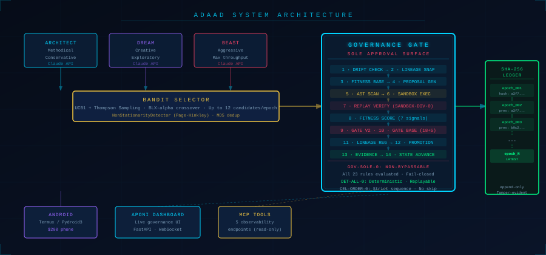
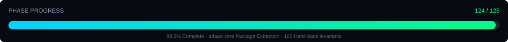
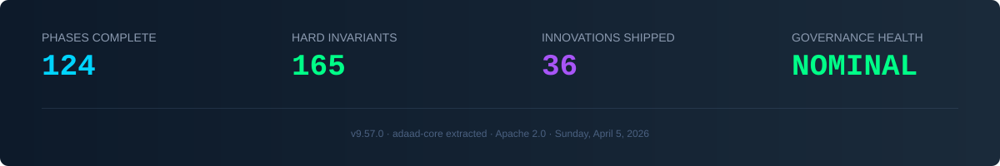
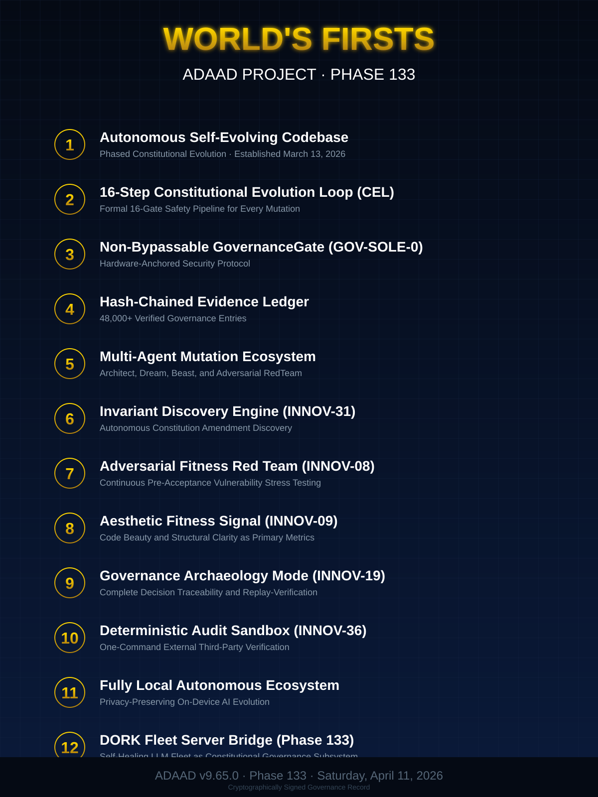

<div align="center">

<!-- ADAAD_VERSION_HERO:START -->

<!-- ADAAD_VERSION_HERO:END -->

<br/>

<a href="#quickstart">⚡ Quickstart</a>&nbsp;&nbsp;·&nbsp;&nbsp;<a href="docs/CONSTITUTION.md">📜 Constitution</a>&nbsp;&nbsp;·&nbsp;&nbsp;<a href="ROADMAP.md">🗺 Roadmap</a>&nbsp;&nbsp;·&nbsp;&nbsp;<a href="docs/thesis/ADAAD_THESIS.md">📖 Thesis</a>&nbsp;&nbsp;·&nbsp;&nbsp;<a href="DORK.md">🕵️ DORK</a>&nbsp;&nbsp;·&nbsp;&nbsp;<a href="TRUST_CENTER.md">🏛 Trust Center</a>&nbsp;&nbsp;·&nbsp;&nbsp;<a href="docs/VERIFIABLE_CLAIMS.md">✅ Verifiable Claims</a>&nbsp;&nbsp;·&nbsp;&nbsp;<a href="CHANGELOG.md">📋 Changelog</a>

<br/>

[](LICENSE)&nbsp;[](https://python.org)&nbsp;[](CHANGELOG.md)&nbsp;[](docs/governance/V8_CONSTITUTIONAL_INVARIANTS_MATRIX.md)&nbsp;[](https://github.com/InnovativeAI-adaad/adaad/commits/main)

</div>


<div align="center">

## The only AI system that governs its own evolution — and can prove it.

**ADAAD is not a tool you run. It is a system that runs itself — within constitutional boundaries you set, sign, and own.**

Every mutation is proposed by AI agents, challenged by an adversarial red team, shadow-executed against live traffic, scored across 216 constitutional invariants, and sealed with a cryptographic proof chain before it can touch production. Your GPG key is the only key that unlocks critical changes. That is not configurable.

</div>


## 🌍 World's firsts — verified, replayable, publicly auditable

These aren't design goals. They are shipped, hash-chained, GPG-attested milestones. Each one has a ledger entry and replay instructions below.

| # | Claim | Evidence |
|:---:|:---|:---:|
| **1** | First constitutionally governed autonomous codebase to self-evolve in production | [→ Phase 65](#-march-13-2026--first-autonomous-self-evolution-phase-65--the-founding-event) |
| **2** | First 16-gate Constitutional Evolution Loop with cryptographic proof per mutation | [→ CEL](#the-pipeline) |
| **3** | First non-bypassable GovernanceGate as a constitutional primitive (`GOV-SOLE-0`) | [→ Architecture](#architecture) |
| **4** | First adversarial red-team agent structurally incapable of approving its own challenges (`AFRT-0`) | [→ INNOV-08](#shipped-capabilities) |
| **5** | First hash-chained identity self-model consulted before every mutation proposal (`MMEM-0`) | [→ INNOV-10](#shipped-capabilities) |
| **6** | First constitutional jury requiring 2-of-3 multi-agent verdict for high-stakes mutations (`CJS-0`) | [→ INNOV-14](#shipped-capabilities) |
| **7** | First AI system with a meta-governance entropy budget governing its own constitutional change velocity (`CEB-0`) | [→ INNOV-26](#shipped-capabilities) |
| **8** | First autonomous governance kernel extractable as a standalone semver-managed package (`adaad-core`) | [→ Phase 124](#-april-5-2026--adaad-core-package-extraction-phase-124) |
| **8b** | First constitutionally governed community amendment pipeline — structurally incapable of autonomous constitutional change (`COMMUNITY-HUMAN0-0`) | [→ Phase 125](#community-governance) |
| **9** | First governed AI system with `SELF-AWARE-0`: no mutation may reduce self-monitoring observability | [→ INNOV-28](#shipped-capabilities) |
| **10** | First AI to pass its own constitutional self-recognition test before promotion (`mirror_test.py`) | [→ INNOV-30](#shipped-capabilities) |
| **11** | First governed AI codebase designed to run fully locally on a $200 Android phone | [→ Android](#platform-support) |
| **12** | First autonomous system with deterministic audit sandbox for one-command third-party verification | [→ INNOV-36](#shipped-capabilities) |
| **13** | First constitutionally governed Red-Team Response Engine with HUMAN-0-gated amendment routing (`GRRP`) | [→ INNOV-37](#shipped-capabilities) |
| **14** | First adversarially-driven constitutional self-amendment engine with cryptographic provenance (`ACSA`) | [→ INNOV-38](#shipped-capabilities) |
| **15** | First governed agent coalition formation system with proportional stake redistribution (`ACF`) | [→ INNOV-39](#shipped-capabilities) |
| **16** | First cryptographically provenance-tracked cross-epoch agent behavioral profile transfer (`CELT`) | [→ INNOV-40](#shipped-capabilities) |
| **17** | First constitutional fail-closed LLM provider fleet with hash-chained conversation ledger (`DORK Living Fleet`) | [→ INNOV-41](#shipped-capabilities) |
| **18** | First self-healing LLM provider fleet wired as a governed constitutional subsystem with fsync-persistent ledger (`DFSB`) | [→ INNOV-42](#shipped-capabilities) |


## What ADAAD is

**ADAAD is a constitutionally governed autonomous code evolution runtime.**

It runs a continuous loop: propose → challenge → shadow-execute → score → gate → prove → ledger. Every pass through this loop produces a cryptographic evidence artifact. Every artifact is hash-chained to every prior artifact. Every critical decision requires your GPG-signed sign-off. There is no side channel.

ADAAD is not a copilot, not CI/CD, not an agent that writes features for you. It is a runtime that governs whether mutations to its own codebase are constitutionally valid — and keeps the ledger to prove it.

```
ADAAD evolves code.
The Constitution governs evolution.
You govern the Constitution.
The ledger is tamper-evident.
```


## Enforced guarantees

These are runtime-enforced invariants. Violating any one **aborts the epoch immediately**. No warning. No retry. No configuration option changes this.

| Guarantee | Mechanism | Invariant |
|:---|:---|:---:|
| Every epoch produces a verifiable evidence hash | SHA-256 hash-chained append-only ledger | `CEL-EVIDENCE-0` |
| Mutations are byte-identical replayable from original inputs | No `datetime.now()` or `random.random()` in constitutional paths | `CEL-REPLAY-0` |
| Pipeline steps cannot be skipped or reordered | Runtime sequence check — out-of-order aborts immediately | `CEL-ORDER-0` |
| Governance gate is the only promotion path | `GovernanceGateV2` is the only path — no side channel exists | `GOV-SOLE-0` |
| Shadow harness writes nothing to production | Zero-write enforcement + egress detection | `LSME-0` |
| Red Team agent cannot approve its own challenges | Structural constraint in code — PASS or RETURNED only | `AFRT-0` |
| Identity check never blocks an epoch | Fail-open with fallback score injection | `MMEM-0` |
| Critical mutations require GPG-signed human approval | Architecturally enforced — not a configuration option | `HUMAN-0` |
| Import boundaries block unauthorized dependencies | Static enforcement — violations block merge | `AST-IMPORT-0` |
| High-stakes mutations require 2-of-3 jury verdict | `ConstitutionalJury.deliberate()` is the sole authority | `CJS-0` |
| Governance drift rate capped at 30% before double sign-off | Meta-governance limits constitutional change velocity | `CEB-0` |
| No mutation may reduce self-monitoring observability | Transparency is structural and non-negotiable | `SELF-AWARE-0` |
| adaad-core exports are semver-governed and HUMAN-0 gated | Breaking changes require major version bump + ratification | `CORE-SEMVER-0` |
| **216 Hard-class invariants enforced at runtime** | Epoch aborts on any violation — no silent failures | 216 total |

→ [Full invariants matrix](docs/governance/V8_CONSTITUTIONAL_INVARIANTS_MATRIX.md) · [Constitution](docs/CONSTITUTION.md) · [Verifiable claims](docs/VERIFIABLE_CLAIMS.md)


## The pipeline



Every proposed change traverses all steps in strict order. There is no skip path, no override flag, no configuration that changes this.

<details>
<summary><b>Step-by-step breakdown</b></summary>
<br/>

**Step 0 — Identity check**
Before any proposal is generated, the `IdentityContextInjector` consults the `IdentityLedger` — a hash-chained, HUMAN-0-attested self-model. First AI system to ask: *is this mutation consistent with what this system believes itself to be?*

**Phase 1 — Proposal**
Claude-powered agents (Architect · Dream · Beast) generate `MutationCandidate`s. UCB1 bandit selector routes to the highest-performing agent. Agents stake reputation on proposals — failed proposals burn stake.

**Phase 2–3 — Adversarial Red Team**
`AdversarialRedTeamAgent` queries `CodeIntelModel` for uncovered code paths, generates up to 5 targeted adversarial cases. Structurally incapable of approving. PASS or RETURNED only.

**Phase 4 — Constitutional Scoring**
`FitnessEngineV2` scores against 8 fitness signals. All runtime-enforced constitutional rules checked. Rule violation halts epoch immediately.

**Phase 5 — Live Shadow Execution**
Zero-write shadow harness against real traffic patterns. Divergence rate, error delta, P99 latency. Regression on any signal is a hard block.

**Phase 6 — Constitutional Jury**
For high-stakes mutations: `ConstitutionalJury.deliberate()` convenes 3 independent evaluators. 2-of-3 approve required. Dissenting verdicts committed to dissent ledger.

**Phase 7 — Governance Gate**
`GovernanceGateV2` evaluates the full evidence package. All prior gates must pass. Verdict: APPROVED · RETURNED · BLOCKED.

**Phase 8 — Human Sign-off (Tier 0)**
For critical mutations: GPG-signed approval from governor is required. The system is architecturally incapable of promoting Tier 0 mutations without it.

**Phase 9 — Ledger Commit + Cryptographic Proof DAG**
Every decision is SHA-256 hash-chained. Full mutation lineage Merkle-rooted. Every causal ancestor cryptographically linked. Legal-grade provenance.

</details>


## Architecture



ADAAD runs a **16-step Constitutional Evolution Loop (CEL)** on every proposed change. Three AI agents — **Architect**, **Dream**, and **Beast** — apply constitutional rules at different steps. No single agent can approve a change. The Constitutional Jury gate adds multi-agent adversarial evaluation for high-stakes paths.

<details>
<summary><b>Module map and boundary contracts</b></summary>
<br/>

**Runtime layer** — `runtime/`

| Module | Role |
|:---|:---|
| `evolution/evolution_loop.py` | Orchestrates the 16-phase epoch. Phase 0d MMEM wire lives here. |
| `evolution/constitutional_evolution_loop.py` | 16-step CEL dispatch. Calls GovernanceGate, AFRT, LSME, CJS. |
| `evolution/fitness_v2.py` | `FitnessEngineV2` — 8-signal scoring including identity. |
| `memory/identity_ledger.py` | Hash-chained HUMAN-0-gated `IdentityLedger`. MMEM-0/CHAIN-0/LEDGER-0. |
| `innovations30/__init__.py` | Boot completeness gate — all 36 importable or `RuntimeError` (INNOV-COMPLETE-0). |
| `innovations30/constitutional_jury.py` | INNOV-14 — 2-of-3 quorum, dissent ledger, high-stakes gate. |
| `innovations30/constitutional_entropy_budget.py` | INNOV-26 — governance drift rate limiter, double-HUMAN-0 at 30%. |
| `innovations30/self_awareness_invariant.py` | INNOV-28 — structural observability protection. |
| `innovations30/mirror_test.py` | INNOV-30 — constitutional self-recognition test, pipeline seal. |
| `lineage/lineage_ledger_v2.py` | Second-gen lineage store with MMEM co-commit surface. |
| `capability_graph.py` | Module capability contracts. No `__import__` — enforced. |

**Governance kernel** — `adaad_core/` *(v9.58.0+)*

```python
from adaad_core import (
    GovernanceGate,
    ConstitutionalRollbackEngine,
    InvariantDiscoveryEngine,
    MirrorTestEngine,
    EpochMemoryStore,
    verify_ledger,
)
```

The governance kernel is now independently installable (`pip install adaad-core`). Semver-governed. Breaking changes require `CORE-SEMVER-0` ratification and major version bump. See [ADAAD_CORE_API.md](docs/ADAAD_CORE_API.md).

**Import boundary contract:** All module-to-module imports must cross defined seams. `AST-IMPORT-0` CI gate blocks violations. Every file must carry `# SPDX-License-Identifier: Apache-2.0`.

</details>


## Shipped capabilities



<details>
<summary><b>Full innovation index — all 42 shipped</b></summary>
<br/>

| # | Innovation | Phase | Core claim |
|:---:|:---|:---:|:---|
| INNOV-01 | `constitutional_stress_test.py` | 87 | AI proposes amendments to its own rules under unconditional HUMAN-0 ratification |
| INNOV-02 | `self_awareness_invariant.py` | 87 | Dedicated agent stress-tests every constitutional rule by attempting to violate it |
| INNOV-03 | `temporal_governance.py` | 87 | Predicts which invariants will be violated in future epochs before they fail |
| INNOV-04 | `constitutional_entropy_budget.py` | 88 | Detects constitutional behaviour drift from historical baseline |
| INNOV-05 | `governance_archaeology.py` | 89 | Proposes new architectural organs to close capability gaps — HUMAN-0 ratification required |
| INNOV-06 | `counterfactual_fitness.py` | 90 | Full lineage Merkle-rooted · independently verifiable · legal-grade provenance |
| INNOV-07 | `temporal_regret.py` | 91 | Zero-write shadow harness · real traffic · hard block on regression |
| INNOV-08 | `red_team_agent.py` | 92 | Red Team gate before scoring · structurally incapable of approving · PASS or RETURNED only |
| INNOV-09 | `aesthetic_fitness.py` | 93 | Code readability as constitutionally-bounded first-class fitness dimension |
| INNOV-10 | `morphogenetic_memory.py` | 94 | Hash-chained self-model consulted pre-proposal · identity drift detection at the root |
| INNOV-11 | `dream_state.py` | 96 | Offline cross-epoch mutation memory consolidation — governed synaptic replay |
| INNOV-12 | `mutation_genealogy.py` | 97 | Property inheritance vectors on lineage edges · population-genetics-level analysis |
| INNOV-13 | `knowledge_transfer.py` | 98 | Cryptographically verified cross-instance knowledge transfer |
| INNOV-14 | `constitutional_jury.py` | 99 | 2-of-3 multi-agent jury for high-stakes mutations · dissent feeds invariant discovery |
| INNOV-15 | `reputation_staking.py` | 100 | Agents stake reputation on proposals · failed proposals burn stake |
| INNOV-16 | `emergent_roles.py` | 101 | Agents develop constitutional specializations from evolutionary fitness history |
| INNOV-17 | `agent_postmortem.py` | 102 | Governed autopsy of failed mutations · extracts constitutional invariants from failure |
| INNOV-18 | `temporal_governance.py` | 103 | Time-conditional constitutional rules · governance adapts to epoch context |
| INNOV-19 | `reputation_staking.py` | 104 | Archaeological analysis of constitutional decision history |
| INNOV-20 | `blast_radius_model.py` | 105 | Systematic adversarial probing of the full constitutional boundary surface |
| INNOV-21 | `governance_bankruptcy.py` | 106 | Governed constitutional reset under catastrophic governance failure |
| INNOV-22 | `mutation_conflict_framework.py` | 107 | Fitness signals conditioned on live market and economic context |
| INNOV-23 | `constitutional_epoch_sentinel.py` | 108 | Constitutional rule mapping to external regulatory frameworks (EU AI Act, NIST RMF) |
| INNOV-24 | `semantic_version_enforcer.py` | 109 | Constitutional enforcement of semantic versioning across all four canonical files |
| INNOV-25 | `hardware_adaptive_fitness.py` | 110 | Fitness signals that adapt to available compute and memory constraints |
| INNOV-26 | `constitutional_entropy_budget.py` | 111 | Meta-governance: rate-limits constitutional drift — 30% rule-change threshold triggers double-HUMAN-0 |
| INNOV-27 | `regulatory_compliance.py` | 112 | Pre-promotion blast radius estimation · constitutional bound on mutation impact scope |
| INNOV-28 | `intent_preservation.py` | 113 | No mutation may reduce system self-monitoring observability — transparency is constitutional |
| INNOV-29 | `curiosity_engine.py` | 114 | Constitutional curiosity drive — governed exploration of under-explored mutation space |
| INNOV-30 | `mirror_test.py` | 115 | Constitutionally governed self-recognition test — final seal of the Innovations30 pipeline |
| INNOV-31 | `invariant_discovery.py` | 116 | Autonomous Invariant Discovery — mines failure ledger for patterns |
| INNOV-32 | `constitutional_rollback.py` | 117 | Governed Constitutional Rollback — versioned chain-linked snapshot ledger |
| INNOV-33 | `knowledge_bundle_exchange.py` | 118 | Knowledge Bundle Exchange (KBEP) — cryptographically verified capability transfer |
| INNOV-34 | `federation_governance_consensus.py` | 119 | Federation Governance Consensus — strict majority quorum for amendments |
| INNOV-35 | `self_proposing_innovation_engine.py` | 120 | Self-Proposing Capability Engine (SPIE) — system identifies its own gaps |
| INNOV-36 | `deterministic_audit_sandbox.py` | 121 | One-command external third-party verification of any epoch |
| INNOV-37 | `governed_redteam_response_protocol.py` | 127 | Red-Team Response Engine: HUMAN-0-gated amendment routing from adversarial findings |
| INNOV-38 | `autonomous_constitutional_self_amendment.py` | 128 | Adversarially-driven constitutional self-amendment with cryptographic provenance |
| INNOV-39 | `agent_coalition_formation.py` | 129 | Governed agent coalition formation with proportional stake redistribution |
| INNOV-40 | `cross_epoch_agent_learning_transfer.py` | 130 | Cryptographically verified cross-epoch agent behavioral profile transfer |
| INNOV-41 | `dork_living_fleet.py` | 132 | Constitutional fail-closed LLM provider fleet with hash-chained conversation ledger |
| INNOV-42 | `dork_fleet_server_bridge.py` | 133 | Self-healing LLM fleet as a governed constitutional subsystem; fsync-persistent ledger |

Full specifications: [ADAAD_30_INNOVATIONS.md](ADAAD_30_INNOVATIONS.md)

</details>


## Timeline — proven milestones, not promises



<br/>

<details open>
<summary><b>⛓ March 13, 2026 — First autonomous self-evolution (Phase 65) — the founding event</b></summary>
<br/>

ADAAD identified its own highest-priority capability gap, generated a mutation, ran a sandboxed fitness tournament, scored it against constitutional rules, applied it, and sealed the proof in the ledger. Zero human intervention in the execution path. Full human control of the constitutional framework.

This is the first externally documented instance of a constitutionally governed AI system autonomously modifying its own codebase within a formally verified governance boundary. The ledger entry, evidence hash, and replay instructions are public.

**Verify it yourself:**
```bash
python -m app.main --replay strict --epoch-id phase65-emergence-001 --verbose
# Expected: byte-identical evidence_hash · APPROVED verdict · 1 mutation applied
# Any divergence = blocking integrity signal
```


</details>

<details>
<summary><b>🔐 March 23, 2026 — Cryptographic Evolution Proof DAG (Phase 90 · INNOV-06)</b></summary>
<br/>

Every mutation cryptographically bound to all causal ancestors via Merkle root. `CryptographicProofBundle` is self-contained — independently verifiable without system access. Legal-grade provenance for auditors, regulators, and patent counsel.
</details>

<details>
<summary><b>🛡 March 24, 2026 — Live Shadow Mutation Execution (Phase 91 · INNOV-07)</b></summary>
<br/>

Zero-write shadow harness against real traffic. `ShadowFitnessReport`: divergence rate · error delta · P99 latency. `LSME-0`: any write or egress = hard block. A mutation must survive shadow execution *and* governance gate to advance.
</details>

<details>
<summary><b>⚔ March 27, 2026 — Adversarial Red Team as a Constitutional Gate (Phase 92 · INNOV-08)</b></summary>
<br/>

`AdversarialRedTeamAgent` challenges every proposal before fitness scoring. `AFRT-0`: structurally incapable of approving — PASS or RETURNED only. Eliminates the single-agent approval failure mode present in all prior autonomous code systems.
</details>

<details>
<summary><b>🧬 March 28, 2026 — Morphogenetic Memory (Phase 94 · INNOV-10)</b></summary>
<br/>

`IdentityLedger` — 8 founding `IdentityStatement`s, hash-chained, HUMAN-0-attested. `IdentityContextInjector` fires Phase 0d before proposals are generated. First AI system to ask: *is this mutation consistent with what this system believes itself to be?*
</details>

<details>
<summary><b>🌙 March 30, 2026 — Cross-Epoch Dream State Engine (Phase 96 · INNOV-11)</b></summary>
<br/>

Between active epochs, `DreamStateEngine` replays successful past mutations in novel cross-epoch combinations — analogous to offline synaptic replay in biological memory systems.
</details>

<details>
<summary><b>⚖️ April 1, 2026 — Constitutional Jury System (Phase 99 · INNOV-14)</b></summary>
<br/>

High-stakes mutations require 2-of-3 independent agent jury verdict before governance gate. Dissenting verdicts are cryptographically committed and fed to `InvariantDiscoveryEngine` — disagreement becomes constitutional signal.
</details>

<details>
<summary><b>🔭 April 4, 2026 — Innovations36 Complete + Deterministic Audit Sandbox (Phase 121 · INNOV-36)</b></summary>
<br/>

All 36 constitutional innovations shipped. `boot_completeness_check()` confirms all modules importable at runtime. Any epoch verifiable with `docker compose up das-demo` — no system access required.
</details>

<details>
<summary><b>📦 April 5, 2026 — adaad-core Package Extraction (Phase 124)</b></summary>
<br/>

The constitutional governance kernel extracted as `adaad_core` — a standalone, semver-governed, independently installable package. Six stable exports: `GovernanceGate`, `ConstitutionalRollbackEngine`, `InvariantDiscoveryEngine`, `MirrorTestEngine`, `EpochMemoryStore`, `verify_ledger`. 

Breaking changes require `CORE-SEMVER-0` ratification and HUMAN-0 approval. The governance kernel is now a first-class public API. 179 Hard-class invariants. See [ADAAD_CORE_API.md](docs/ADAAD_CORE_API.md).
</details>

<details>
<summary><b>🏛 April 5, 2026 — Community Governance Infrastructure (Phase 125)</b></summary>
<br/>

**First constitutionally governed community amendment pipeline — structurally incapable of autonomous constitutional change (`COMMUNITY-HUMAN0-0`).**

Community members can now propose constitutional amendments through a governed pipeline: GitHub Issue template → CI validator (quorum check, rationale length ≥50 words, conflict analysis) → FGCON review → HUMAN-0 ratification. Two new Hard-class invariants enforce what no AI agent may override:

- `COMMUNITY-FGCON-0` — a single contributor cannot ratify. Community amendments require FGCON quorum.
- `COMMUNITY-HUMAN0-0` — HUMAN-0 ratification cannot be delegated or automated via any workflow.

The CI gate (`constitution_amendment_validation.yml`) structurally rejects any PR that claims autonomous ratification. See [GOVERNANCE_PARTICIPATION.md](docs/GOVERNANCE_PARTICIPATION.md) for the full amendment lifecycle.
</details>

<details>
<summary><b>⚔️ April 6, 2026 — Red-Team Challenge + Governed Response Protocol (Phases 126–127 · INNOV-37)</b></summary>
<br/>

Phase 126 introduced a constitutional invariant attacker with halt-on-silent-pass enforcement — every invariant is systematically challenged before any epoch promotion.

Phase 127 closed the loop: the `GovernedRedTeamResponseProtocol` routes adversarial findings through a HUMAN-0-gated amendment pipeline. Red-team findings cannot silently expire — each generates a structured finding record, routed for constitutional amendment or explicit HUMAN-0 dismissal.
</details>

<details>
<summary><b>🧬 April 8, 2026 — Autonomous Constitutional Self-Amendment Engine (Phase 128 · INNOV-38)</b></summary>
<br/>

`AutonomousConstitutionalSelfAmendmentEngine` (ACSA) enables adversarially-driven constitutional self-amendment: the system can propose changes to its own constitution in response to red-team findings, with full cryptographic provenance. Every proposed amendment is hash-chained, HUMAN-0-gated, and structurally incapable of self-ratification.
</details>

<details>
<summary><b>🤝 April 8, 2026 — Agent Coalition Formation (Phase 129 · INNOV-39)</b></summary>
<br/>

`AgentCoalitionFormation` (ACF) introduces governed multi-agent coalitions for complex mutation proposals. Agents form coalitions with proportional stake redistribution — coalition fitness is evaluated jointly, and stake flows to contributors proportionally to their fitness contribution. Coalitions that fail constitutional scoring burn collective stake.
</details>

<details>
<summary><b>🔗 April 8, 2026 — Cross-Epoch Agent Learning Transfer (Phase 130 · INNOV-40)</b></summary>
<br/>

`CrossEpochAgentLearningTransfer` (CELT) enables cryptographically verified behavioral profile transfer between agents across epoch boundaries. Agent specializations earned through fitness history can be explicitly transferred to successor agents, with the transfer record hash-chained to the lineage ledger.
</details>

<details>
<summary><b>🌊 April 10, 2026 — DORK Living Fleet (Phase 132 · INNOV-41)</b></summary>
<br/>

`DORKLivingFleet` is a governed, multi-engine LLM provider orchestrator that routes DORK queries through a constitutional fail-closed fleet. Six Hard-class invariants govern every dispatch boundary: unknown slash commands are structurally rejected, fleet blocking is structurally enforced, and all conversations are hash-chained to a persistent ledger. Jaccard-taxonomy intent routing classifies every query before dispatch.
</details>

<details>
<summary><b>🛠 April 11, 2026 — DORK Fleet Server Bridge (Phase 133 · INNOV-42)</b></summary>
<br/>

`DORKFleetServerBridge` (DFSB) wires the Living Fleet into `server.py` as a first-class constitutional governance subsystem. Six new REST endpoints. `DorkLedgerPersistence` provides fsync-on-write append-only conversation ledger with restart continuity provable from genesis. `DorkFleetWatchdog` is an asyncio auto-heal loop that transitions BLOCKED→ACTIVE automatically and logs every state transition to the audit ledger. Fleet fitness is embedded in every governance health response (`DFSB-FITNESS-0`).
</details>

<a name="community-governance"></a>


## Why you can trust the claims

Every guarantee below is runtime-enforced. Not a policy. Not a pledge. Violation aborts the epoch.

| Gate | What it checks | Invariant |
|:---|:---|:---:|
| ⛓ **Tamper-evident ledger** | SHA-256 hash-chained — alter one entry and every subsequent hash breaks | `CEL-EVIDENCE-0` |
| ♻️ **Deterministic replay** | Any epoch re-runs from original inputs producing byte-identical results | `CEL-REPLAY-0` |
| 📜 **Constitutional gate** | 165 rules evaluated at runtime — violation halts epoch | `GOV-SOLE-0` |
| ⚔️ **Adversarial red-team** | Every mutation challenged before scoring — cannot approve | `AFRT-0` |
| 🛡 **Shadow execution** | Zero-write harness before live promotion | `LSME-0` |
| 🔬 **Identity gate** | Self-model consulted before proposals are generated | `MMEM-0` |
| ⚖️ **Constitutional jury** | 2-of-3 verdict for high-stakes mutations — dissent feeds invariant discovery | `CJS-QUORUM-0` |
| 🌡 **Entropy budget** | Constitutional change velocity is itself governed — 30% drift cap | `CEB-0` |
| 👁 **Self-awareness** | No mutation may reduce self-monitoring observability | `SELF-AWARE-0` |
| 🗺 **Cryptographic lineage** | Merkle-rooted proof DAG — independently verifiable without system access | `CEPD-0` |
| 🔑 **Human authority** | GPG key required for Tier 0 — not configurable, not delegatable | `HUMAN-0` |
| 📦 **API stability** | adaad-core breaking changes require major bump + HUMAN-0 ratification | `CORE-SEMVER-0` |

→ [Constitution](docs/CONSTITUTION.md) · [Trust Center](TRUST_CENTER.md) · [Security Invariants Matrix](docs/governance/V8_CONSTITUTIONAL_INVARIANTS_MATRIX.md)


## What you control vs. what the system handles

| **What only you can do** | **What ADAAD handles autonomously** |
|:---|:---|
| 🔑 GPG-sign Tier 0 changes | Generate mutation proposals via Claude agents |
| 🌱 Approve seed promotions | Red-team challenge every proposal before scoring |
| 📜 Set constitutional rules | Shadow-execute mutations in zero-write harness |
| 🏷 Tag version ceremonies | Score against 211 constitutional invariants |
| ⚙️ Ratify new Hard-class invariants | Hash-chain every decision into the ledger |
| 🧬 Amend `IdentityLedger` statements | Consult self-model before every proposal |
| 📋 Patent and IP decisions | Build cryptographic evolution proof DAGs |
| ✅ GA sign-off | Mine failure patterns · propose new invariants |
| 🏛 Jury composition policy | Convene constitutional jury for high-stakes paths |


<a name="quickstart"></a>
## ⚡ Quickstart

```bash
git clone https://github.com/InnovativeAI-adaad/adaad.git
cd adaad
python onboard.py
```

`onboard.py` sets up your environment, validates governance schemas, and runs a governed dry-run. Safe to re-run any time.

**What success looks like:**
```
  ✔ Python 3.12.x
  ✔ Dependencies installed
  ✔ Boot completeness: 36/36 innovations importable [INNOV-COMPLETE-0]
  ✔ Dry-run complete  (fail-closed behaviour confirmed)

  Run the dashboard   python server.py
  Run an epoch        adaad demo
  Inspect ledger      adaad inspect-ledger data/evolution_ledger.jsonl
  Propose mutation    adaad propose "upgrade system x"
  Strict replay       python -m app.main --replay strict --verbose
```

### Use the governance kernel directly

```bash
pip install adaad-core
```

```python
from adaad_core import GovernanceGate, verify_ledger

gate = GovernanceGate.from_config("config/constitution.yaml")
result = gate.evaluate(candidate)           # APPROVED · RETURNED · BLOCKED

chain_ok = verify_ledger("data/evolution_ledger.jsonl")
print("Ledger integrity:", chain_ok)        # True = unbroken hash chain
```

### CLI

```bash
./scripts/adaad --help
./scripts/adaad demo              # Run a dry-run epoch
./scripts/adaad inspect-ledger    # View ledger summary
./scripts/adaad propose "desc"    # Submit a mutation proposal
```

### Local development server

```bash
pip install -r requirements.server.txt
ADAAD_AUDIT_TOKENS="" uvicorn server:app --host 127.0.0.1 --port 8000
```

| Dashboard | URL |
|:---|:---|
| Aponi governance UI | `http://127.0.0.1:8000/ui/aponi/index.html` |
| Developer Whale.Dic | `http://127.0.0.1:8000/ui/developer/ADAADdev/whaledic.html` |

### Deterministic audit environment

```bash
python3.12 -m venv .venv && source .venv/bin/activate
pip install -e .[dev]
export ADAAD_SEED=42 PYTHONHASHSEED=0
python -m app.main --replay audit --verbose
```

<details>
<summary id="platform-support"><b>Platform support</b></summary>
<br/>

| Platform | Method |
|:---|:---|
| Linux / macOS | `pip install adaad` or clone above |
| Windows | `pip install adaad` (WSL2 for sandbox) |
| Android (Termux) | [TERMUX_SETUP.md](TERMUX_SETUP.md) |
| Android (Pydroid 3) | [INSTALL_ANDROID.md](INSTALL_ANDROID.md) |
| Docker | `docker pull ghcr.io/innovativeai-adaad/adaad` |

*Safety properties come from SHA-256 hash chains and the Python runtime — not cloud KMS, Kubernetes, or any third-party service. If those go away, so do your safety guarantees. ADAAD's guarantees are local, deterministic, and yours.*

</details>


## Replay and audit

### Verify the Phase 65 founding event

```bash
python -m app.main --replay strict --epoch-id phase65-emergence-001 --verbose
# Expected: byte-identical evidence_hash, APPROVED verdict, 1 mutation applied
# Divergence = blocking integrity signal. Check: Python version, PYTHONHASHSEED, deps.
```

### Inspect the governance chain

```bash
python -c "
import json, hashlib
events = [json.loads(l) for l in open('security/ledger/governance_events.jsonl')]
print(f'Events: {len(events)}')
print(f'Latest: {events[-1][\"event_id\"]}')
print(f'Hash:   {events[-1][\"event_hash\"][:48]}...')
"
```

### Verify identity ledger

```bash
python -c "
from runtime.memory.identity_ledger import IdentityLedger
ledger = IdentityLedger.load_genesis()
print('Chain valid:', ledger.verify_chain())
for s in ledger.statements():
    print(f'  {s.statement_id}: {s.statement[:72]}...')
"
```

### Confirm no unauthorized imports

```bash
python scripts/check_spdx_headers.py
# All files must carry: # SPDX-License-Identifier: Apache-2.0
```

### One-command third-party audit

```bash
docker compose up das-demo
# Runs the Deterministic Audit Sandbox against a public epoch
# No system access required beyond this repository
```


## Governance in 60 seconds

ADAAD evolves through numbered phases. Each phase ships a specific capability, registers findings, resolves them with evidence, and chains a governance ledger entry before merge. **No phase ships without a HUMAN-0 attestation and a four-file canonical version sync.**

### Recent phases

| Phase | Capability | Invariants added | Status |
|:---:|:---|:---:|:---:|
| 121 | Deterministic Audit Sandbox (INNOV-36) | `DAS-EPOCH-0` · `DAS-DETERM-0` | ✅ |
| 122 | README Credibility + ROADMAP Sync | — | ✅ |
| 123 | CLI Entry Point (`adaad` binary) | `CLI-SANDBOX-0` · `CLI-GATE-0` | ✅ |
| 124 | adaad-core Package Extraction | `CORE-EXPORT-0` · `CORE-IMPORT-0` · `CORE-SEMVER-0` | ✅ |
| 125 | Community Governance Infrastructure | `COMMUNITY-FGCON-0` · `COMMUNITY-HUMAN0-0` | ✅ |
| 126 | Red-Team Challenge (Invariant Attacker) | `RTCA-HALT-0` · `RTCA-SILENT-0` | ✅ |
| 127 | Governed Red-Team Response Protocol (INNOV-37) | `GRRP-ROUTE-0` · `GRRP-HUMAN0-0` | ✅ |
| 128 | Autonomous Constitutional Self-Amendment (INNOV-38) | `ACSA-PROV-0` · `ACSA-HUMAN0-0` | ✅ |
| 129 | Agent Coalition Formation (INNOV-39) | `ACF-STAKE-0` · `ACF-QUORUM-0` | ✅ |
| 130 | Cross-Epoch Agent Learning Transfer (INNOV-40) | `CELT-CHAIN-0` · `CELT-PROV-0` | ✅ |
| 132 | DORK Living Fleet (INNOV-41) | `DORK-CMD-0` · `FLEET-BLOCK-0` + 4 more | ✅ |
| **133** | **DORK Fleet Server Bridge (INNOV-42)** | `DFSB-PERSIST-0` · `DFSB-HEAL-0` · `DFSB-FITNESS-0` · `DFSB-GATE-0` | ✅ |

<details>
<summary><b>How a phase ships (contributor reference)</b></summary>
<br/>

1. ArchitectAgent produces a specification for the phase
2. MutationAgent implements on a `feature/phase<N>-*` branch
3. All 30 acceptance tests pass · no regressions · TIER 0 invariant checks green
4. HUMAN-0 signs off: `Approved. All signed: Dustin L. Reid`
5. `--no-ff` merge to main (lineage preserved — mandatory)
6. CHANGELOG entry + VERSION bump + GPG-signed tag
7. Agent state updated + governance ledger event chained
8. Push

</details>


## For contributors

<details>
<summary><b>Required reading before opening any PR</b></summary>
<br/>

- [CONTRIBUTING.md](CONTRIBUTING.md) — development setup, PR flow, required checks
- [docs/CONSTITUTION.md](docs/CONSTITUTION.md) — constitutional rules, governance philosophy
- [docs/governance/V8_CONSTITUTIONAL_INVARIANTS_MATRIX.md](docs/governance/V8_CONSTITUTIONAL_INVARIANTS_MATRIX.md) — all Hard-class invariants

</details>

<details>
<summary><b>Local checks before every PR</b></summary>
<br/>

```bash
pytest --tb=short -q                          # All must pass
python scripts/check_spdx_headers.py          # SPDX headers on all source files
python scripts/check_dependency_baseline.py   # Import boundary enforcement
python scripts/check_licenses.py              # License compliance
python -m app.main --replay audit --verbose   # Replay integrity
python nexus_setup.py --validate-only         # Workspace validation
```

</details>

<details>
<summary><b>PR evidence requirements</b></summary>
<br/>

Every governance-impacting PR must include:
- **Branch**: `feature/phase<N>-<descriptor>` or `fix/phase<N>-<descriptor>`
- **Test count**: number of new tests added
- **Invariants**: any new Hard-class invariants introduced
- **Evidence hash**: from a local epoch run
- **HUMAN-0 sign-off**: governor approval before merge

PRs without evidence artifacts are returned, not merged.

</details>


## Security and trust

**SPDX enforcement** — Every source file must carry `# SPDX-License-Identifier: Apache-2.0`. Missing headers block merge via CI.

**Import boundary enforcement** — Module seams are defined and enforced. Cross-layer imports without boundary contract updates block merge via `AST-IMPORT-0`.

**Replay divergence** — Any divergence from expected evidence hash is a blocking integrity signal. Not a warning.

**Key management** — HUMAN-0 GPG key (`4C95E2F99A775335B1CF3DAF247B015A1CCD95F6`) signs all release tags and Tier 0 governance events. Key is not stored in this repository.

**IdentityLedger attestation** — ILA-124-2026-04-05-001 attests the genesis seed terminal hash. External auditors can verify independently.

**Report security issues** via `SECURITY.md`. Do not open public issues for vulnerability reports.

→ [Full Trust Center](TRUST_CENTER.md) · [Compliance Pack](docs/compliance/)


## Live system stats

<!-- AUTO-UPDATED: stats card regenerates on every merge to main -->


<div align="center">

[](https://github.com/InnovativeAI-adaad/adaad/commits/main)&nbsp;[](https://github.com/InnovativeAI-adaad/adaad/commits/main)&nbsp;[](https://github.com/InnovativeAI-adaad/adaad)&nbsp;[](https://github.com/InnovativeAI-adaad/adaad/issues)

</div>


## Versioning

ADAAD uses a **phase-correlated version scheme** by design. Each minor increment in the `v9.x.0` series corresponds to one shipped, HUMAN-0-attested, evidence-linked governance phase.

`v9.58.0` means 124 governed phase milestones have shipped in the v9 series. Each phase delivers: a governance ledger event, a HUMAN-0 `session_digest` sign-off, 30 passing acceptance tests, a CHANGELOG entry, and a four-file canonical version sync (`VERSION` · `pyproject.toml` · `.adaad_agent_state.json` · `governance/report_version.json`).


## Named roles

| Name | Role |
|:---|:---|
| **Architect** | Structural mutation agent. Prioritizes maintainability and constitutional alignment. |
| **Dream** | Exploratory mutation agent. Novel approaches, capability gap identification. |
| **Beast** | Performance mutation agent. Throughput, efficiency, bottleneck pressure. |
| **Cryovant** | Identity and device-anchoring layer. Session tokens, audit signatures, trust anchoring. |
| **Aponi** | Governance dashboard. Audit UI, mutation lineage viewer, live epoch status. |
| **HUMAN-0** | The governor role. Dustin L. Reid. Holds GPG key. Ratifies constitutional changes. |

*These are runtime roles. They are not APIs and not marketing personas.*


## Enterprise and commercial use

<details>
<summary><b>Commercial documentation suite</b></summary>
<br/>

| Resource | What it is |
|:---|:---|
| [Pricing Model](docs/commercial/PRICING_MODEL.md) | Seat-based, usage-based, and hybrid SKUs |
| [Procurement Fast-Lane](docs/commercial/procurement_fastlane/DAY0_PROCUREMENT_FASTLANE_CHECKLIST.md) | Day-0 checklist, DPA/MSA fallback clauses, security Q&A — designed for 5-day close |
| [SLO / SLA Sheet](docs/commercial/procurement_fastlane/SLA_SLO_SHEET.md) | Reliability targets and support tier commitments |
| [Compliance Pack](docs/compliance/) | Data handling, access control matrix, incident response |
| [Trust Center](TRUST_CENTER.md) | Security posture and governance assurance artifacts |
| [Certification Program](docs/training/CERTIFICATION_PROGRAM.md) | Operator · Governance Engineer · Enterprise Administrator |
| [Partner Program](docs/commercial/PARTNER_PROGRAM.md) | Integrator and consultancy onboarding |
| [Data Room Index](docs/strategy/DATA_ROOM_INDEX.md) | Due-diligence artifact map |
| [ROI Model](docs/commercial/ROI_MODEL.md) | Value quantification framework for governance automation |

</details>


## How ADAAD compares

ADAAD is in a category of one. The table below is structured around verifiable, runtime-enforced properties — not feature checkboxes.

| Capability | ADAAD | GitHub Copilot / Devin | CodeRabbit / Qodo | Traditional CI/CD |
|:---|:---:|:---:|:---:|:---:|
| Autonomous code mutation with governance gate | ✅ | ❌ | ❌ | ❌ |
| Adversarial red-team challenge before scoring | ✅ | ❌ | ❌ | ❌ |
| Zero-write shadow execution against live traffic | ✅ | ❌ | ❌ | ❌ |
| SHA-256 hash-chained tamper-evident ledger | ✅ | ❌ | ❌ | ❌ |
| Byte-identical deterministic epoch replay | ✅ | ❌ | ❌ | ⚠️ partial |
| Constitutional self-model (Morphogenetic Memory) | ✅ | ❌ | ❌ | ❌ |
| 2-of-3 multi-agent jury for high-stakes mutations | ✅ | ❌ | ❌ | ❌ |
| Runtime-enforced Hard-class invariants (216) | ✅ | ❌ | ❌ | ❌ |
| HUMAN-0 GPG key required for critical changes | ✅ | ❌ | ❌ | ⚠️ policy only |
| Governance drift rate capped (30% entropy budget) | ✅ | ❌ | ❌ | ❌ |
| Cryptographic evolution proof DAG (Merkle-rooted) | ✅ | ❌ | ❌ | ❌ |
| Independently installable governance kernel () | ✅ | ❌ | ❌ | ❌ |
| One-command third-party audit sandbox | ✅ | ❌ | ❌ | ⚠️ partial |
| Runs on a 00 Android phone (no cloud dependency) | ✅ | ❌ | ❌ | ❌ |
| Open source, Apache 2.0 | ✅ | ❌ | ⚠️ partial | ✅ |
| Constitutional self-evolution in production (Phase 65) | ✅ | ❌ | ❌ | ❌ |

**Key distinction:** Tools like Copilot and Devin generate or suggest code. CodeRabbit reviews it. CI/CD tests it. ADAAD governs whether mutations to its own codebase are constitutionally valid — and produces cryptographic proof of every decision. These are not competing categories. They are adjacent layers. ADAAD occupies the layer none of them reach.

→ [Full competitive analysis](docs/COMPETITIVE_ANALYSIS.md) · [Verifiable claims](docs/VERIFIABLE_CLAIMS.md)


## What ADAAD is not

- ❌ **Not a code assistant** — it governs mutation of its own codebase, not yours
- ❌ **Not CI/CD** — it governs the mutation process, not the build pipeline
- ❌ **Not fully autonomous** — your sign-off is constitutionally required for critical changes
- ❌ **Not a security scanner** — it enforces mutation governance, not vulnerability detection
- ❌ **Not magic** — every decision is logged, hash-chained, replayable, and explainable


## FAQ

<details>
<summary><b>Is this actually running autonomously?</b></summary>
<br/>

Yes. Phase 65 (March 13, 2026) was the first epoch where ADAAD identified a capability gap, generated a mutation, ran it through all fitness and governance layers, and applied it with zero human intervention in the execution path.

Human oversight is structural, not optional. The governor holds the GPG key. Any Tier 0 mutation requires GPG-signed approval. That is not configurable.
</details>

<details>
<summary><b>What makes this different from running tests in CI?</b></summary>
<br/>

CI tests whether known code passes known assertions. ADAAD governs whether *changes to the codebase itself* are constitutionally valid, adversarially stress-tested, fitness-improving, and deterministically replayable.

You can delete your CI history. You cannot alter ADAAD's ledger.

ADAAD actively challenges its own proposals via adversarial red-team agents, checks them against its encoded self-model, and runs them through zero-write shadow execution before they reach production. No CI system does this. No CI system has 165 constitutional rules it's bound by. No CI system produces a cryptographic proof of its evolutionary lineage.
</details>

<details>
<summary><b>How does the adversarial Red Team work?</b></summary>
<br/>

Every mutation proposal is handed to `AdversarialRedTeamAgent` before fitness scoring. It queries `CodeIntelModel` for code paths the proposing agent didn't cover, then generates up to five targeted adversarial cases. Each runs in a read-only sandbox.

If any case falsifies the proposal, it returns a `RedTeamFindingsReport`. `AFRT-0`: the agent cannot approve — structurally enforced in code, not policy. Its only outputs are PASS or RETURNED.
</details>

<details>
<summary><b>What is Morphogenetic Memory?</b></summary>
<br/>

MMEM (INNOV-10, Phase 94) is a formally encoded architectural self-model: a hash-chained, HUMAN-0-gated, append-only `IdentityLedger` containing founding `IdentityStatement`s that define what ADAAD believes itself to be.

Before every epoch's proposals are generated (Phase 0d), the `IdentityContextInjector` consults the ledger and injects `identity_consistency_score` into `CodebaseContext`. This score is available to all downstream stages.

It answers the question no prior gate could ask: *is this mutation consistent with what this system believes itself to be?*
</details>

<details>
<summary><b>What is adaad-core?</b></summary>
<br/>

`adaad-core` (Phase 124, v9.58.0) is the constitutional governance kernel extracted as a standalone, independently installable Python package. It exposes six semver-governed exports: `GovernanceGate`, `ConstitutionalRollbackEngine`, `InvariantDiscoveryEngine`, `MirrorTestEngine`, `EpochMemoryStore`, and `verify_ledger`.

Breaking changes require `CORE-SEMVER-0` ratification and HUMAN-0 approval, enforced by CI. It is the first AI governance primitive designed to be embedded in external systems. See [ADAAD_CORE_API.md](docs/ADAAD_CORE_API.md).
</details>

<details>
<summary><b>Why does it run on a $200 Android phone?</b></summary>
<br/>

Constitutional governance should not require enterprise infrastructure. ADAAD's safety properties come from SHA-256 hash chains and the Python runtime — not cloud KMS, Kubernetes, or any third-party service. If those go away, so do your safety guarantees. ADAAD's guarantees are local, deterministic, and yours.
</details>

<details>
<summary><b>How do I evaluate ADAAD for enterprise procurement?</b></summary>
<br/>

Start with the [Trust Center](TRUST_CENTER.md). The [Procurement Fast-Lane package](docs/commercial/procurement_fastlane/DAY0_PROCUREMENT_FASTLANE_CHECKLIST.md) is designed to complete security and legal review within 5 business days.
</details>


## Roadmap

**124 phases complete. 179 Hard-class invariants. 36 innovations shipped. adaad-core extracted.**

**Short term** — adaad-core PyPI publication, community governance infrastructure, formal GA release hardening.

**Mid term** — device-anchored mobile runtime graduation, reproducible packaging, cross-device federation.

**Long term** — Full autonomy graduation, v1.1-GA Release.

→ [Full roadmap](ROADMAP.md) · [36 Innovations specification](ADAAD_30_INNOVATIONS.md)


<div align="center">



<br/><br/>

**Built by [Innovative AI LLC](https://github.com/InnovativeAI-adaad) · Governor: Dustin L. Reid · Blackwell, Oklahoma**

<br/>

*The next wave of AI isn't AI that writes your code.*
*It's AI that governs itself while writing your code —*
*and can prove it.*

<br/>

[](https://github.com/InnovativeAI-adaad/adaad#quickstart)&nbsp;[](docs/CONSTITUTION.md)&nbsp;[](TRUST_CENTER.md)&nbsp;[](docs/thesis/ADAAD_THESIS.md)

<br/>

*Build without limits. Govern without compromise.*

</div>
