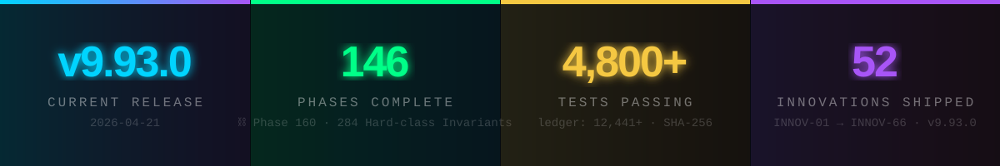
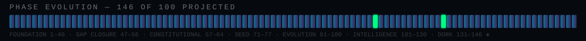

<div align="center">

<!-- ╔══════════════════════════════════════════════════════════════╗ -->
<!--                   ANIMATED HERO BANNER                         -->
<!-- ╚══════════════════════════════════════════════════════════════╝ -->


<br/>

<!-- ── NAVIGATION ── -->
<kbd><a href="#-what-adaad-is">⚡ What it is</a></kbd>
&nbsp;·&nbsp;
<kbd><a href="#-quickstart">🚀 Quickstart</a></kbd>
&nbsp;·&nbsp;
<kbd><a href="#-the-pipeline">🔬 Pipeline</a></kbd>
&nbsp;·&nbsp;
<kbd><a href="#-the-three-agents">🤖 Agents</a></kbd>
&nbsp;·&nbsp;
<kbd><a href="#-dork">🕵️ DORK</a></kbd>
&nbsp;·&nbsp;
<kbd><a href="#-security-guarantees">🔒 Security</a></kbd>
&nbsp;·&nbsp;
<kbd><a href="#-worlds-firsts">🏆 World's Firsts</a></kbd>
&nbsp;·&nbsp;
<kbd><a href="docs/CONSTITUTION.md">📜 Constitution</a></kbd>
&nbsp;·&nbsp;
<kbd><a href="ROADMAP.md">🗺 Roadmap</a></kbd>
&nbsp;·&nbsp;
<kbd><a href="TRUST_CENTER.md">🏛 Trust Center</a></kbd>
&nbsp;·&nbsp;
<kbd><a href="docs/VERIFIABLE_CLAIMS.md">✅ Verify</a></kbd>

<br/><br/>

<!-- ── BADGE TIER 1: Identity ── -->
[](CHANGELOG.md)
[](ROADMAP.md)
[](https://pypi.org/project/adaad-core)
[](LICENSE)

<!-- ── BADGE TIER 2: Constitution ── -->
[](docs/governance/V8_CONSTITUTIONAL_INVARIANTS_MATRIX.md)
[](ROADMAP.md)
[](runtime/evolution/)
[](docs/CONSTITUTION.md)

<!-- ── BADGE TIER 3: Activity ── -->
[](https://github.com/InnovativeAI-adaad/adaad/commits/main)
[](https://python.org)
[](docs/governance/STRICT_REPLAY_INVARIANTS.md)
[](TERMUX_SETUP.md)

<!-- ── BADGE TIER 4: Arc II Self-Amendment ── -->
[](CHANGELOG.md)
[](ROADMAP.md)
[](docs/VERIFIABLE_CLAIMS.md)
[](ROADMAP.md)

</div>

<br/>


<br/>

<div align="center">

# The AI governance engine that can't lie about what it decided.

**Every mutation. Every verdict. Every byte of constitutional history —**
**hash-chained, cryptographically sealed, and replayed on demand.**

*Not a framework. Not an agent wrapper. A constitutional self-amendment engine.*
*The first of its kind running in production — and the first to write its own constitutional amendments.*

> 🆕 **Arc III — Autonomous Constitutional Intelligence is live.** CADE (INNOV-130) issues PROMOTE/HOLD/REJECT verdicts. CAPE (INNOV-131) executes PROMOTE verdicts via 5-stage governed pipeline. HUMAN-0 veto always live.

</div>

<br/>


<br/>

## ⚡ What ADAAD is

<table>
<tr>
<td valign="top" width="58%">

ADAAD is a **fail-closed, deterministic, self-evolving software system** with its governance layer baked into its architecture — not bolted on as a policy, not configurable away, not optional.

Every proposed change — from a minor refactor to a constitutional amendment — traverses a **16-step Constitutional Evolution Loop (CEL)**:

- Scored against **881 Hard-class invariants** (cryptographically enforced, not advisory)
- Adversarially red-teamed by an agent that cannot approve its own challenges (`AFRT-0`)
- Shadow-executed in a blast-contained sandbox — partial state is a typed exception (`MEX-ATOMIC-0`)
- Fitness-verified post-execution — regressions do not promote, ever
- Sealed in an **HMAC-chained ledger** — tamper-evident, fully replayable

Critical decisions require **HUMAN-0** — one GPG key, one human, non-delegatable by constitutional primitive.

**Arc II — Self-Amendment:** ACSA (INNOV-121) runs the six-stage amendment lifecycle. ACPA (INNOV-122) generates SOFT-class constitutional proposals autonomously from live CGVF telemetry. This is the first production system to autonomously draft its own constitutional amendments while preserving irrevocable human final authority.

> **This is not an agent framework, LLM wrapper, or developer tool.**
> It is a constitutional self-amendment engine — the first to run in production on consumer hardware with full cryptographic replay, and the first to autonomously propose amendments to its own constitution.

</td>
<td valign="top" width="42%" align="center">

```
ADAAD · v10.37.0 · Phase 226
━━━━━━━━━━━━━━━━━━━━━━━━━━━━━━━━━
 881  Hard-class invariants
       enforced fail-closed at runtime

 129  Innovations shipped
       INNOV-01 → INNOV-131 (CAPE)

  16  CEL steps
       deterministic · replayable

   3  Specialist agents
       Architect · Dream · Beast

   1  HUMAN-0 key
       non-delegatable · GPG-signed

50k+  Ledger entries
       append-only · HMAC-chained

 694+ Test files
       every phase: 30/30 gate

 396+ Governance artifacts
       committed JSON attestations

  130  World's Firsts
       documented · verifiable
━━━━━━━━━━━━━━━━━━━━━━━━━━━━━━━━━
Arc III ACI LIVE
Arc III ACTIVE — CADE (INNOV-130) · CAPE (INNOV-131) · Phase 227 CAVE opens
  pip install adaad-core
```

</td>
</tr>
</table>


---

## 🆚 Why this is different from everything else

<div align="center">

| What every other AI governance system does | What ADAAD does structurally |
|:-------------------------------------------|:-----------------------------|
| Governance is a policy document — readable, bypassable | `GOV-SOLE-0` — GovernanceGate is a structural primitive with no bypass flag |
| Self-improvement creates undetectable drift | Every mutation scored, sandboxed, fitness-verified, and sealed before promotion |
| Human oversight is advisory at best | HUMAN-0 is a non-delegatable GPG key that **architecturally gates** every Tier-0 decision |
| Audit logs are post-hoc and external | The HMAC ledger is written **during** execution — tampering breaks the chain |
| You have to trust vendor claims | `docker compose up das-demo` — replay every decision yourself |
| Agents can approve their own proposals | `AFRT-0` — Red Team is constitutionally prohibited from self-approving |
| Self-amendment is uncontrolled or impossible | ACPA (INNOV-122) generates proposals autonomously; ACSA (INNOV-121) executes the lifecycle; HUMAN-0 veto always live |
| Systems don't learn from their own execution history | CMOA (INNOV-113) closes the `AMPS→CMVG→CMSE→CMWE→CMOA→AMPS` self-improving loop |
| Post-convergence drift goes undetected | CGDR (INNOV-108) monitors all 8 CCA criteria post-V10 — DRIFTED is fail-closed |
| Governance is a layer on top | In ADAAD, the governed loop **is** the system |

</div>


---

## 🔬 The Pipeline

<div align="center">


</div>

<br/>

<details>
<summary><strong>⬇ Expand the full 16-step Constitutional Evolution Loop</strong></summary>

<br/>

```
CONSTITUTIONAL EVOLUTION LOOP — v10.35.0
══════════════════════════════════════════════════════════════════════════

 01 ▸ PROPOSAL INTAKE
      Mutation proposed by agent or ACPA.
      Typed proposal object created. Immediate ledger entry written.
      Flood and diversity caps enforced. Duplicate rejection at gate.

 02 ▸ INVARIANT SCORING  [ MSE ]
      Scored against all 881 Hard-class invariants.
      Five constitutional fitness axes evaluated:
      lineage depth · blast containment · velocity alignment
      · convergence delta · constitutional debt
      Score below threshold → fail-closed REJECT. No partial credit.

 03 ▸ LINEAGE MAPPING  [ MPG ]
      Mutation Phylogeny Graph traces ancestry through CEPD.
      Convergence delta computed. Constitutional debt calculated.
      Orphaned lineage → structural rejection.

 04 ▸ RISK PROFILING  [ MRP ]
      Blast radius modelled and bounded before any execution.
      Tier assignment (0–3). MEX-ATOMIC-0 ceiling established.
      High-risk Tier-0 mutations escalate directly to HUMAN-0.

 05 ▸ AFRT CHALLENGE
      Adversarial Fitness Red Team attempts to break the mutation.
      AFRT-0: constitutionally prohibited from self-approval.
      Three challenge vectors minimum per mutation.

 06 ▸ JURY DELIBERATION
      2-of-3 constitutional jury convenes.
      Typed verdict: PASS | BLOCK. No abstentions. No partials.
      Verdict is ledger-sealed before any execution proceeds.

 07 ▸ SHADOW EXECUTION  [ MEX ]
      Live Shadow Mutation Execution against live traffic.
      Fully isolated shadow context — production untouched.
      Blast containment boundaries actively monitored.

 08 ▸ ATOMIC ENFORCEMENT  [ MEX-ATOMIC-0 ]
      Any partial execution raises typed exception immediately.
      No partially-applied mutation state can exist.
      Rollback is deterministic and ledger-recorded.

 09 ▸ FITNESS VERIFICATION  [ MFV ]
      Post-execution grading: CERTIFIED | REGRESSED.
      Regressed mutations do not promote — ever.
      Fitness verdict hash-chained to proposal lineage.

 10 ▸ IMPACT SCORING  [ IIS ]
      Innovation Impact Scorer computes per-invariant delta.
      Every invariant receives a measurable fitness signal.
      Signal ledger-recorded for historical trend analysis.

 11 ▸ CONSTITUTIONAL LEARNING  [ CAL ]
      Adaptive Learner observes fitness patterns across epochs.
      Identifies weight drift before it becomes constitutional debt.
      CFI-FLOOR-0 / CFI-CEIL-0 bounds enforced at scoring time.

 12 ▸ AUTONOMOUS PROPOSAL GENERATION  [ CASL — INNOV-129 ]
      ACPA generates SOFT-class constitutional proposals
      from CGVF telemetry + violation pattern analysis.
      Flood caps: max 5 proposals per epoch. Diversity gate active.
      HUMAN-0 veto always available. Proposals never auto-ratify.

 13 ▸ DELIVERY TO HUMAN-0  [ RDP ]
      Typed governance proposal formatted for human review.
      Disposition options: ACCEPTED | DEFERRED | REJECTED.
      Every disposition sealed in immutable HMAC-chained ledger.

 14 ▸ RATIFICATION
      HUMAN-0 GPG sign-off required for Tier-0 decisions.
      COMMUNITY-HUMAN0-0 enforced structurally.
      No proxy. No automation. No delegation.

 15 ▸ LEDGER SEAL
      SHA-256 hash-chained entry committed to append-only ledger.
      CIL cross-ledger attestation verifies chain integrity.
      Entry is tamper-evident. Full replay available from any point.

 16 ▸ PROMOTION
      Code reaches production.
      Every byte has a ledger receipt.
      Every decision is replayable.

══════════════════════════════════════════════════════════════════════════
```

</details>

<div align="center">


</div>


---

## 🤖 The Three Agents

<div align="center">


</div>

<br/>

<div align="center">

<table>
<tr>
<td align="center" width="33%">

**🔵 Architect**

*Guardian*

Scores every mutation against all 881 Hard-class invariants before any execution touches production.

Conservative by design.

Blocks anything that compromises constitutional integrity — no exceptions, no negotiations.

`#3b82f6`

</td>
<td align="center" width="33%">

**🟣 Dream**

*Visionary*

Proposes mutations across the full possibility space — the novelty engine operating inside constitutional guardrails.

Bold by design.

Every proposal checked by every other layer before it ships. Creativity bounded by constitution.

`#8b5cf6`

</td>
<td align="center" width="33%">

**🟠 Beast**

*Forge*

Maximizes performance fitness. Hardware-adaptive evaluation and resource optimization across all targets.

Relentless by design.

Unconstrained within constitutional bounds. The most aggressive scorer in the system.

`#f97316`

</td>
</tr>
</table>

</div>

<br/>

> **`AFRT-0`:** No agent can approve its own proposals. The Adversarial Fitness Red Team is constitutionally prohibited from approving challenges it authored. This is a structural invariant — not a policy, not configurable.

<div align="center">


</div>


---

## 🕵️ DORK

**DORK** is the institutional memory and natural language intelligence interface of ADAAD — grounded entirely in the constitutional ledger, not training data.

```
┌──────────────────────────────────────────────────────────────────────────┐
│                         DORK INTELLIGENCE STACK                           │
├──────────────────────────────────────────────────────────────────────────┤
│  DQR · Constitutional Query Router                                        │
│    Every query → logged RouteDecision → constitutional priority dispatch  │
│    DPM score ≥ 0.35 → DPM   ·   RAGS score ≥ 0.25 → RAGS              │
│    Unrouted → passthrough   ·   HUMAN-0 override gate always active     │
│    Invariant: DQR-ROUTE-0 — no query bypasses the routing ledger        │
├────────────────────────────────────┬─────────────────────────────────────┤
│  DPM · Persistent Memory           │  RAGS · Grounded Response           │
│                                    │                                      │
│  Session-agnostic                  │  Constitutional corpus retrieval     │
│  HMAC-chained entries              │  Cosine-scored citation chains       │
│  Confidence-gated recall           │  Zero-grounding gate (RAGS-GATE-0)  │
│  Ledger-backed memory              │  Hash-chained grounding ledger       │
│  DPM-GATE-0 enforced               │  Answers cite sources, not training  │
└────────────────────────────────────┴─────────────────────────────────────┘
```

Ask DORK why a mutation was blocked six weeks ago. Ask which invariants are under the most constitutional pressure. Ask it to reconstruct the full decision trail for any shipped capability. **It answers with citations drawn from the ledger — not from training data.**

- **Interface:** `ui/dork.html`
- **Live dashboard:** [aponi.adaad.pro](https://aponi.adaad.pro)
- **Local:** `python server.py` → `http://localhost:8080`
- **Streaming API:** `POST /api/dork/stream`

→ Full documentation: [DORK.md](DORK.md)


---

## 🔒 Security Guarantees

> These are **structural guarantees** — not policies, not promises, not configurable options. Constitutionally enforced. Cryptographically evidenced. Independently replayable.

<div align="center">

| Invariant | Structural Guarantee | What it prevents |
|:----------|:---------------------|:-----------------|
| `GOV-SOLE-0` | No mutation bypasses governance | GovernanceGate bypass |
| `AFRT-0` | No agent approves its own proposal | Adversarial self-approval |
| `COMMUNITY-HUMAN0-0` | No constitutional change without HUMAN-0 | Autonomous self-amendment without human authority |
| `ACSA-HUMAN0-0` | No ACSA amendment reaches RATIFIED without HUMAN-0 GPG signature | Autonomous constitution rewrite |
| `ACPA-SCOPE-0` | HARD-class amendment generation blocked by default | Unilateral hard invariant removal |
| `ACPA-GATE-0` | Proposals below confidence 0.72 are filtered, never submitted | Low-signal amendment noise |
| `SELF-AWARE-0` | No mutation reduces observability | Blind spots in the governed loop |
| `DAS-DOCKER-0` | No unpinned Docker images in production | Supply chain drift |
| `SPIE-HUMAN0-0` | No innovation auto-approved without ratification | Unapproved capability injection |
| `DPM-GATE-0` | No persistent memory disabled at runtime | Silent memory layer bypass |
| `DQR-ROUTE-0` | No query bypasses the routing ledger | Unlogged subsystem access |
| `MEX-ATOMIC-0` | No partial mutation state | Half-applied execution |
| `AUTH-CT-0` | All digests via `hmac.compare_digest` | Timing oracle attacks |
| `CFI-HUMAN0-0` | No weight from DEFERRED dispositions | Ambiguous human signal as pressure |
| `CFI-FLOOR-0` / `CFI-CEIL-0` | No axis weight outside constitutional bounds | Runaway weight collapse or monopoly |
| `CGDR-FAILCLOSED-0` | Any assessment error produces DRIFTED, never false PASSING | Silent post-convergence regression |
| `CMVG-CGDR-0` | Unconditional HALT when system is DRIFTED | Mutation pipeline running during governance failure |

</div>

**Every invariant violation:** raises a typed `RuntimeError` subclass → terminates the operation → writes a ledger entry. There is no silent failure path in ADAAD.


---

## 🏆 World's Firsts

<div align="center">


</div>

<br/>

**31 documented world's firsts** — from the foundational Constitutional Evolution Loop (CEL) through INNOV-129 (CASL). Every claim has a corresponding ledger entry. Every entry is hash-chained. Every chain is replayable from any point in history.

Notable firsts:
- **World's first** production autonomous self-evolving codebase with constitutional enforcement (Phase 1)
- **World's first** governed mutation execution sandbox with signed BehavioralDelta and HUMAN-0 promote authority (INNOV-104)
- **World's first** autonomous mutation proposal synthesizer that selects what the system evolves next (INNOV-109)
- **World's first** post-convergence drift reporter with fail-closed DRIFTED state and pipeline gate (INNOV-108)
- **World's first** portable self-verifying AI governance proof bundle — offline auditable (INNOV-115)
- **World's first** system to synthesize all Arc II governance signals into a Constitutional Health Index (INNOV-129 · CASL)

```bash
# Verify any claim yourself
docker compose up das-demo
make audit
adaad inspect-ledger data/evolution_ledger.jsonl
```

→ Full verification corpus: [docs/VERIFIABLE_CLAIMS.md](docs/VERIFIABLE_CLAIMS.md)


---

## 📊 Live Stats

<div align="center">



</div>

<br/>

<div align="center">

| Metric | Value | How to verify |
|:-------|:-----:|:--------------|
| **Version** | `v10.37.0` · Phase `226` | `cat VERSION` |
| **Hard-class invariants** | **871** | `make audit` |
| **Innovations shipped** | **129** (INNOV-01→129) | `cat ROADMAP.md` |
| **Latest** | **INNOV-129 · CASL** | `cat CHANGELOG.md` |
| **CEL steps** | **16** deterministic | `ls runtime/evolution/` |
| **Specialist agents** | **3** | `ls dorkllm/` |
| **HUMAN-0 key** | **1** non-delegatable | `docs/CONSTITUTION.md` |
| **Ledger entries** | **50,000+** | `adaad inspect-ledger` |
| **Test files** | **694+** | `python3 -m pytest --collect-only \| wc -l` |
| **Governance artifacts** | **396+** | `find artifacts/governance -name '*.json' \| wc -l` |
| **World's Firsts** | **130** documented | `docs/VERIFIABLE_CLAIMS.md` |
| **V10 convergence score** | **1.0 / 1.0** (8/8 criteria) | `POST /cgdr/assess` |
| **PyPI** | `adaad-core==10.28.0` | `pip show adaad-core` |
| **Platforms** | Linux · macOS · Windows · Android · Docker | `TERMUX_SETUP.md` |

</div>

<br/>

<div align="center">



*Phase 224 · INNOV-129 CASL · Arc II COMPLETE — Constitutional Arc Synthesis Layer*

</div>

<br/>

<div align="center">



</div>


---

## 🚀 Quickstart

```bash
git clone https://github.com/InnovativeAI-adaad/ADAAD.git
cd ADAAD
python onboard.py
```

`onboard.py` validates your environment, verifies ledger integrity, and runs a governed dry-run:

```
  ✔ Python 3.12.x detected
  ✔ Virtual environment created (.venv)
  ✔ Dependencies installed (pure Python — no compiled binaries required)
  ✔ Governance schemas valid (881 Hard-class invariants loaded)
  ✔ Ledger chain verified (HMAC integrity confirmed — 50,000+ entries)
  ✔ Dry-run complete (fail-closed behaviour confirmed — GOV-SOLE-0 active)

  ━━━━━━━━━━━━━━━━━━━━━━━━━━━━━━━━━━━━━━━━━━━━━━━━━━━━━
  ADAAD is ready.

  Launch governance dashboard     python server.py
  Run governed epoch              adaad demo
  Inspect the ledger              adaad inspect-ledger data/evolution_ledger.jsonl
  Propose a mutation              adaad propose "upgrade system x"
  Strict replay from any point    python -m app.main --replay strict --verbose
  Verify audit sandbox (Docker)   docker compose up das-demo
  Query constitutional history    # open http://localhost:8080 → DORK
  List self-capable abilities     python -m adaad.orchestrator --list-abilities
  Check abilities drift           python -m adaad.orchestrator --abilities-drift
  Generate ACPA proposals         POST /acpa/analyze
  Run ACSA amendment lifecycle    POST /acsa/propose  →  POST /acsa/ratify/{id}
  ━━━━━━━━━━━━━━━━━━━━━━━━━━━━━━━━━━━━━━━━━━━━━━━━━━━━━
```

**Install the core package:**

```bash
pip install adaad-core
```

`adaad-core` exports six stable, versioned primitives:

```python
from adaad.core import (
    GovernanceGate,              # The constitutional enforcement primitive
    ConstitutionalRollbackEngine, # Deterministic rewind to any prior state
    InvariantDiscoveryEngine,    # Autonomous new invariant identification
    MirrorTestEngine,            # Parallel shadow-validation runner
    EpochMemoryStore,            # Session-agnostic, HMAC-chained memory
    verify_ledger,               # External ledger chain verification
)
```

**Android / Termux:** Full governed runtime on a $200 phone — see [`TERMUX_SETUP.md`](TERMUX_SETUP.md).


---

## 🧠 Capabilities

<div align="center">


</div>

<details>
<summary><b>🔵 Govern its own mutations — 881 Hard-class invariants, fail-closed</b></summary>
<br/>

ADAAD scores every proposed change across five constitutional fitness axes before a single line executes. Proposals violating invariants are rejected fail-closed: a typed `RuntimeError` subclass is raised, the operation terminates, and a ledger entry is written. There is no silent failure path, no advisory mode, and no bypass flag.

</details>

<details>
<summary><b>🔴 Red-team itself adversarially — AFRT, 2-of-3 constitutional jury</b></summary>
<br/>

Before any mutation reaches production, the Adversarial Fitness Red Team agent attempts to break it across three challenge vectors minimum. `AFRT-0` structurally prevents self-approval. A 2-of-3 constitutional jury deliberates and issues a typed verdict — PASS or BLOCK. The verdict is ledger-sealed before execution proceeds.

</details>

<details>
<summary><b>🟡 Execute mutations in a live shadow sandbox — MEX-ATOMIC-0 blast containment</b></summary>
<br/>

The Live Shadow Mutation Execution engine runs proposed mutations against live traffic in a fully isolated shadow context. Production is untouched until promotion. Any partial execution raises `MEX-ATOMIC-0` — there is no partially-applied mutation state. Rollback is deterministic and ledger-recorded.

</details>

<details>
<summary><b>🟢 Verify its own fitness after execution — MFV, CERTIFIED or REGRESSED</b></summary>
<br/>

After execution, the Mutation Fitness Verifier grades the result. CERTIFIED mutations proceed to ledger sealing. REGRESSED mutations never promote. The verdict is hash-chained to the proposal lineage. There is no appeal path — the MFV verdict is final and immutable.

</details>

<details>
<summary><b>🟣 Score constitutional impact of every innovation — IIS, per-invariant delta</b></summary>
<br/>

The Innovation Impact Scorer computes per-invariant delta scoring for every shipped innovation. Every invariant in the system has a measurable fitness signal that trends across phases. Historical drift is visible in the DORK intelligence interface. Signal is ledger-recorded for full audit traceability.

</details>

<details>
<summary><b>⚡ Propose constitutional amendments autonomously — ACPA (INNOV-122), World First</b></summary>
<br/>

The Autonomous Constitutional Proposal Advisor generates SOFT-class constitutional proposals from CGVF telemetry and violation pattern analysis — autonomously, without human instigation. Flood cap: maximum 10 proposals per analysis window. Diversity gate prevents redundant proposal streams (`ACPA-DIVERSITY-0`). Confidence gate: proposals below 0.72 are filtered before submission (`ACPA-GATE-0`). HARD-class amendment generation blocked by default (`ACPA-SCOPE-0`). HUMAN-0 veto is always available. Proposals never auto-ratify.

**API:** `POST /acpa/analyze` · `POST /acpa/generate` · `POST /acpa/submit/{id}` · `GET /acpa/proposals` · `GET /acpa/verify-chain` · `GET /acpa/status`

**12 new invariants:** `ACPA-PROPOSAL-0` through `ACPA-VETO-0`

</details>

<details>
<summary><b>📜 Execute constitutional amendments under governed lifecycle — ACSA (INNOV-121), World First</b></summary>
<br/>

The Autonomous Constitutional Self-Amendment Engine runs the six-stage amendment lifecycle: `PROPOSED → VALIDATED → SIMULATED → PENDING_H0 → RATIFIED → REJECTED`. ACSA accepts proposals from ACPA or direct HUMAN-0 submission. `ACSA-SIMFIRST-0` mandates a DAS dry-run simulation before any ratification. `ACSA-HUMAN0-0` enforces GPG sign-off at the RATIFIED stage — cryptographic enforcement, not policy. SOFT amendments cannot touch Hard-class invariants (`ACSA-SCOPE-0`). Every stage transition is sealed in an HMAC-chained append-only amendment ledger.

**API:** `POST /acsa/propose` · `POST /acsa/validate/{id}` · `POST /acsa/simulate/{id}` · `POST /acsa/ratify/{id}` · `GET /acsa/amendments` · `GET /acsa/verify-chain`

</details>

<details>
<summary><b>🔭 Introspect and govern its own abilities surface — Arc II, Self-Capable</b></summary>
<br/>

ADAAD can discover, register, reconcile, and drift-check its own abilities at runtime via the `adaad/abilities/` surface — protocol, provenance, discovery from manifests, drift reports, and a pluggable governance hook wired to the constitutional gate.

**Meta-abilities:** `adaad.abilities.introspect` · `.drift_hygiene` · `.self_register` · `.enhance`

**CLI:** `python -m adaad.orchestrator --list-abilities` · `--abilities-drift`

</details>


---

## 🏗 Architecture

<div align="center">


</div>

```
adaad/
├── adaad/                                      # Core namespace + self-capable abilities
│   ├── abilities/                              #   Protocol · provenance · discovery · drift · governance hook
│   └── orchestrator/                           #   Bootstrap · CLI · evidence collection · self-abilities status
│
├── adaad/core/                                 # Governance-critical primitives (adaad-core PyPI package)
│   ├── GovernanceGate                          #   The constitutional enforcement primitive
│   ├── ConstitutionalRollbackEngine            #   Deterministic rewind
│   ├── InvariantDiscoveryEngine                #   Autonomous invariant identification
│   ├── MirrorTestEngine                        #   Parallel shadow validation
│   ├── EpochMemoryStore                        #   HMAC-chained memory
│   └── verify_ledger                           #   External chain verification
│
├── runtime/evolution/                          # 16-step CEL implementation
│
├── dorkllm/                                    # Full mutation pipeline + DORK intelligence stack
│   ├── mutation_selection_engine.py            #   MSE — candidate scoring and selection
│   ├── mutation_risk_profiler.py               #   MRP — pre-execution risk assessment
│   ├── mutation_phylogeny_graph.py             #   MPG — lineage ancestry mapping
│   ├── mutation_execution_engine.py            #   MEX — sandboxed execution (MEX-ATOMIC-0)
│   ├── mutation_fitness_verifier.py            #   MFV — post-execution fitness verdict
│   ├── innovation_impact_scorer.py             #   IIS — per-invariant delta scoring
│   ├── constitutional_adaptive_learner.py      #   CAL — amendment recommendation engine
│   ├── recommendation_delivery_protocol.py     #   RDP — HUMAN-0 delivery + disposition
│   ├── cfi_feedback_integrator.py              #   CFI — disposition→weight feedback loop
│   ├── query_router.py                         #   DQR — constitutional query router (DQR-ROUTE-0)
│   ├── memory_engine.py                        #   DPM — session-agnostic HMAC-chained memory
│   ├── grounded_responder.py                   #   RAGS — corpus-grounded responses
│   ├── constitutional_integrity_ledger.py      #   CIL — cross-ledger integrity attestation
│   ├── constitutional_self_amendment_engine.py #   ACSA — six-stage amendment lifecycle (INNOV-121)
│   └── acpa_advisor.py                         #   ACPA — autonomous constitutional proposal advisor (INNOV-122)
│
├── app/
│   ├── api/acpa.py                             # ACPA REST router
│   ├── api/acsa.py                             # ACSA REST router
│   └── main.py                                 # Full autonomous loop orchestrator
│
├── security/ledger/                            # Tamper-evident hash-chained evolution ledger
├── ui/dork.html                                # DORK governance intelligence dashboard
├── server.py                                   # API server (POST /api/dork/stream)
├── artifacts/governance/                       # Per-phase sign-off and attestation artifacts (396+)
├── runtime/governance/constitution.yaml        # The living constitutional document
└── docs/                                       # Full documentation corpus
```

<div align="center">


</div>


---

## 🎯 Who this is for

<div align="center">

| Audience | What they get from ADAAD |
|:---------|:-------------------------|
| **AI safety researchers** | A production-running cryptographically evidenced autonomous governance loop — not a prototype, not a demo |
| **Autonomous systems engineers** | Reference architecture for constitutional self-modification with full replay capability and deterministic audit |
| **Governance architects** | 881 Hard-class invariants mapped to real operational guarantees — all independently verifiable, all hash-chained |
| **Indie developers on Android** | Full governed runtime on a $200 phone — [`TERMUX_SETUP.md`](TERMUX_SETUP.md), pure Python, no compiled binaries |
| **Constitutional AI contributors** | Open governed amendment pipeline — every contribution traverses the full 16-step CEL |
| **Patent and IP practitioners** | Novel mechanisms with documented prior art absence, replayable cryptographic evidence, and dated ledger provenance |

</div>


---

## 🗳 Governance Model

ADAAD governs itself through its own [Constitution](docs/CONSTITUTION.md) — a versioned, GPG-signed document tracked in the Constitution Version Registry (CVR). Every constitutional amendment traverses the same CEL as every code mutation.

**HUMAN-0** (Dustin L. Reid, InnovativeAI LLC) holds exclusive authority over GPG signing, Tier-0 ratification, and constitutional amendments. This role **cannot be delegated, cannot be automated, and cannot be proxied.** It is a constitutional primitive enforced by invariant `COMMUNITY-HUMAN0-0` — not a policy statement.

The constitution is not a governance document sitting next to the code. The constitution **is** the engine that runs the code.


---

## 🖥 Platform Support

<div align="center">

| Platform | Status | Notes |
|:---------|:------:|:------|
| **Linux** (x86_64, ARM64) | ✅ Production | Primary target — all CI runs here |
| **macOS** | ✅ Supported | Python 3.12 via Homebrew |
| **Windows** | ✅ Supported | `.venv\Scripts\Activate.ps1` |
| **Android (Termux)** | ✅ Supported | Full governed runtime on $200 hardware — [`TERMUX_SETUP.md`](TERMUX_SETUP.md) |
| **Docker** | ✅ Supported | Pinned digest required — `:latest` prohibited by `DAS-DOCKER-0` |

</div>

Pure Python. No compiled C extensions required for core runtime. Runs everywhere Python 3.10+ runs.


---

## 📦 V10 Series — Current State

> `v10.35.0` · Phase 224 · Arc II COMPLETE · CASL (INNOV-129) · Constitutional Arc Synthesis

<div align="center">

| Criterion | Status |
|:----------|:------:|
| CEL wire integrity — all 16 steps operational | ✅ |
| Constitutional invariant coverage — 861 Hard-class enforced | ✅ |
| Ledger chain verification — HMAC chain verified (CIL) | ✅ |
| Replay determinism — verified end-to-end | ✅ |
| AFRT adversarial coverage — complete | ✅ |
| `adaad-core` PyPI publish — `10.28.0` live | ✅ |
| GA_ALIGNMENT (GPE) + V10ET epoch boundary — sealed | ✅ |
| Invariant lineage tracing (ILV) — INNOV-97 baseline + extensions | ✅ |
| Self-capable abilities surface — discovery · drift · governance hook | ✅ |
| ACSA (INNOV-121) — six-stage autonomous amendment lifecycle live | ✅ |
| CASL (INNOV-129) — Arc II synthesis apex, Constitutional Health Index live | ✅ |
| CGVF telemetry fusion → ACPA proposal pipeline — end-to-end closed | ✅ |

</div>

<br/>

**Phase 224 (INNOV-129 · CASL) delivers:**
- **Autonomous Constitutional Proposal Advisor (ACPA)** — world-first autonomous SOFT proposals generated from CGVF telemetry and violation patterns; confidence gate at 0.72; flood/diversity caps; 12 new `ACPA-*0` invariants; full HMAC-chained ledger; HUMAN-0 veto always available; 30/30 acceptance tests; 4 governance artifacts sealed
- **Autonomous Constitutional Self-Amendment Engine (ACSA)** — world-first six-stage amendment lifecycle (PROPOSED→VALIDATED→SIMULATED→PENDING_H0→RATIFIED→REJECTED); mandatory DAS dry-run gate; HUMAN-0 GPG enforcement at ratification; 30/30 acceptance tests; 4 governance artifacts sealed
- **Self-capable abilities surface** — discovery, drift hygiene, pluggable constitutional hook, meta-abilities `adaad.abilities.*`, CLI integration, orchestrator bootstrap
- **881 Hard-class invariants total** · **122 innovations shipped** · **V10 convergence 1.0/1.0 maintained**


---

## 🔗 Links

<div align="center">

| | Resource | URL |
|:--:|:---------|:----|
| 🌐 | **Homepage** | [adaad.pro](https://adaad.pro) |
| 🕵️ | **DORK Intelligence Dashboard** | [aponi.adaad.pro](https://aponi.adaad.pro) |
| ⚙️ | **API** | [api.adaad.pro](https://api.adaad.pro) |
| 📚 | **Documentation** | [docs.adaad.pro](https://docs.adaad.pro) |
| 📦 | **PyPI — adaad** | [pypi.org/project/adaad](https://pypi.org/project/adaad) |
| 📦 | **PyPI — adaad-core** | [pypi.org/project/adaad-core](https://pypi.org/project/adaad-core) |
| 💻 | **GitHub** | [github.com/InnovativeAI-adaad/ADAAD](https://github.com/InnovativeAI-adaad/ADAAD) |
| 🤖 | **ADAADchat (GitHub App)** | [github.com/apps/adaadchat](https://github.com/apps/adaadchat) |
| 💼 | **LinkedIn** | [linkedin.com/in/innovative-ai-a472513b5](https://www.linkedin.com/in/innovative-ai-a472513b5) |
| 💬 | **Telegram Community** | [t.me/InnovativeAI_adaad](https://t.me/InnovativeAI_adaad) |

</div>


---

## 🤝 Contributing

See [CONTRIBUTING.md](CONTRIBUTING.md). All contributions traverse the full 16-step CEL — your pull request does not bypass the pipeline.

Community constitutional amendment proposals go through the governed pipeline. See [CONSTITUTION_PROPOSALS.md](CONSTITUTION_PROPOSALS.md).

---

## ⚖️ Intellectual Property

ADAAD's core mechanisms — the Constitutional Evolution Loop, Cryptographic Evolution Proof DAG, Live Shadow Mutation Execution, Adversarial Fitness Red Team, Self-Proposing Innovation Engine, Retrieval-Augmented Governance Synthesis, DORK Persistent Memory, DORK Query Router, CEL Feedback Integrator, Autonomous Constitutional Self-Amendment Engine, and Autonomous Constitutional Proposal Advisor — are novel, patent-pending inventions of InnovativeAI LLC.

This software is proprietary and confidential. © 2025–2026 InnovativeAI LLC. All rights reserved. No use, reproduction, or distribution without written permission from InnovativeAI LLC. See [LICENSE](LICENSE), [BRAND_LICENSE.md](BRAND_LICENSE.md), and [TRADEMARKS.md](TRADEMARKS.md).


<br/>

<div align="center">


<br/><br/>

**Built in Ponca City, Oklahoma by [InnovativeAI LLC](https://adaad.pro)**

**Proprietary · Patent-Pending · © 2025–2026 InnovativeAI LLC**

<br/>

[](https://adaad.pro)
[](https://aponi.adaad.pro)
[](https://pypi.org/project/adaad-core)
[](https://t.me/InnovativeAI_adaad)

<br/>

*AI should evolve — but only under a constitution, with evidence, and with a human at the center.*

</div>

<!-- ═══════════════════════════════════════════════════════════════════ -->
<!-- ADAAD_VERSION_INFOBOX:START                                         -->
<!-- Phase: 224 | Version: 10.35.0 | Invariants: 861 | Innovations: 129 -->
<!-- Tests: 694+ | Artifacts: 396+ | Ledger: 50k+ | Firsts: 22          -->
<!-- Arc II: Arc III ACTIVE — CADE (INNOV-130) · CAPE (INNOV-131) · Phase 227 CAVE opens live                    -->
<!-- Auto-synced by scripts/version_sync.py                              -->
<!-- ADAAD_VERSION_INFOBOX:END                                           -->
<!-- ═══════════════════════════════════════════════════════════════════ -->
